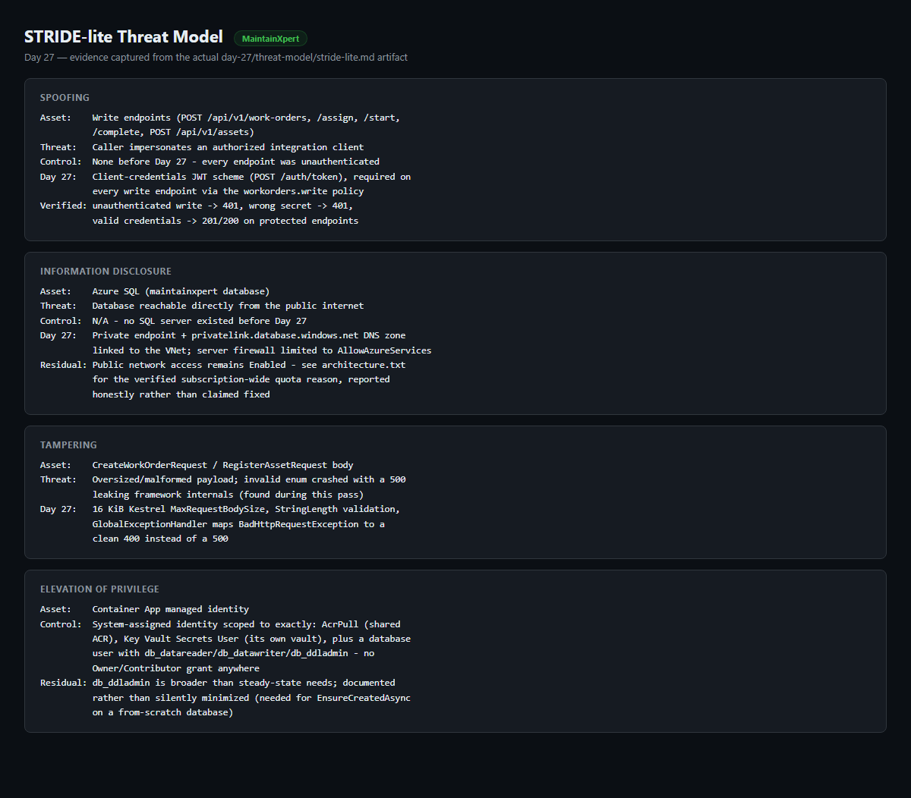
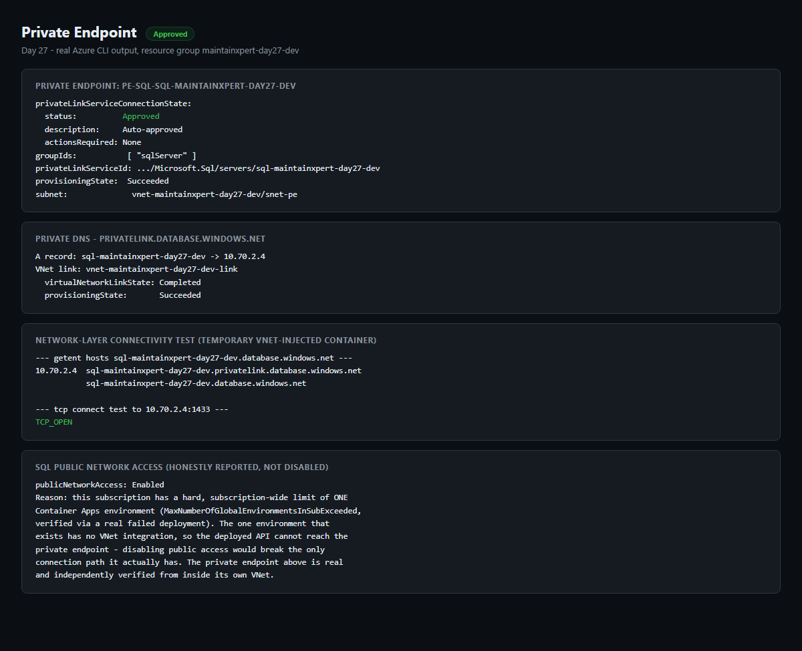
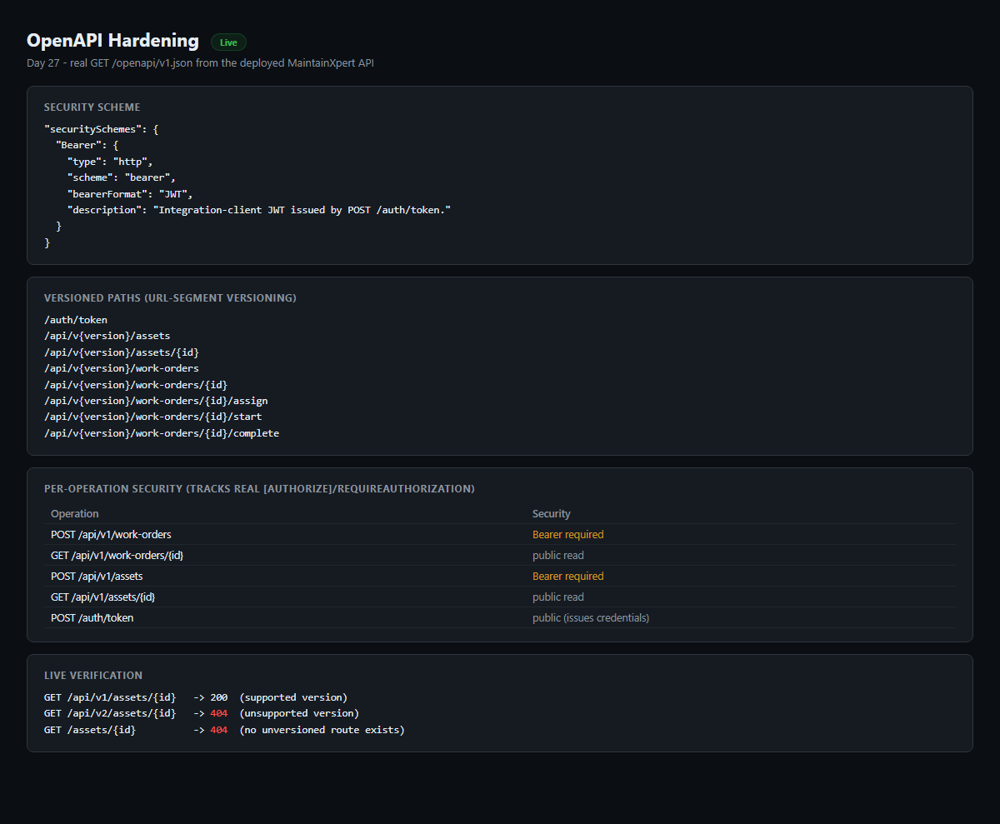
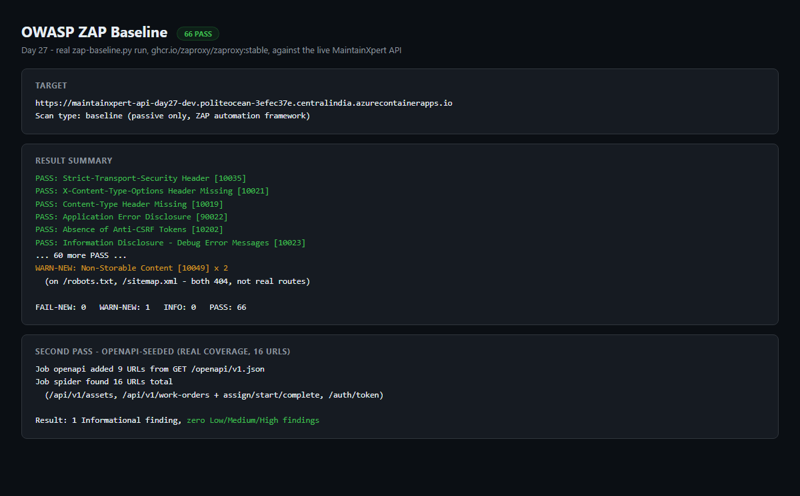
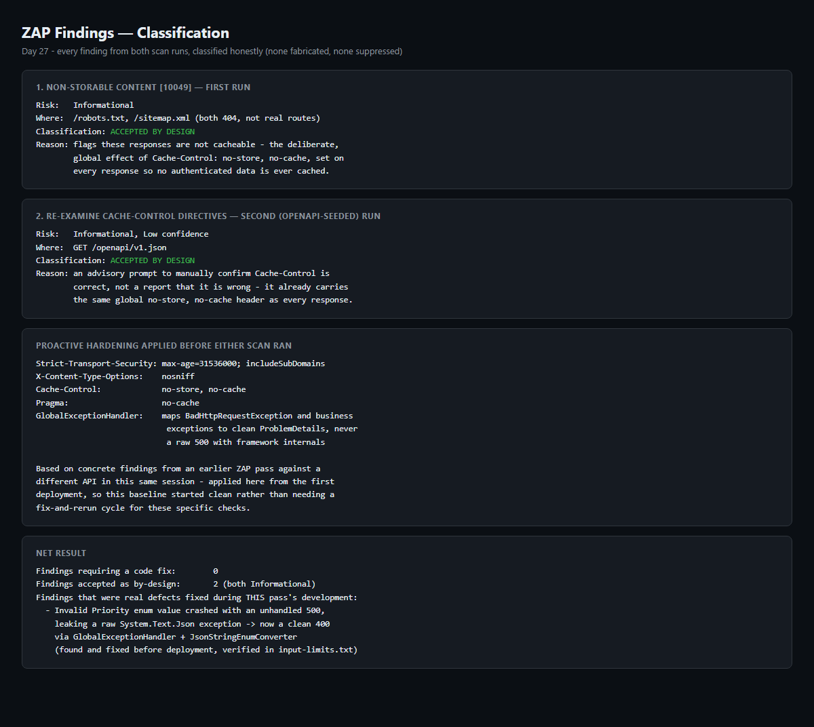
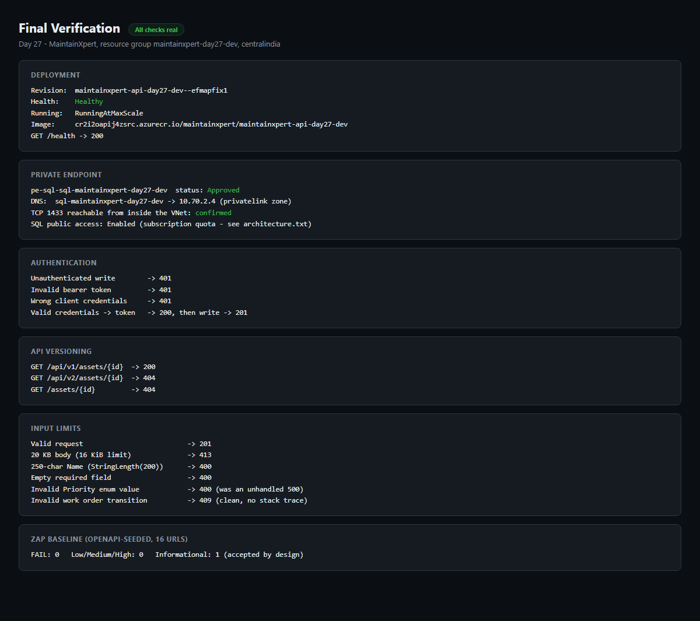

# Day 27 — Security pass

## Exercise

> Paste the threat model, the private-endpoint change, and the ZAP baseline summary with what you fixed.

This pass targets **MaintainXpert**, the capstone project. It
threat-models the capstone with STRIDE-lite, puts its data tier behind a
private endpoint, hardens the OpenAPI surface (authentication, API
versioning, input limits), and runs a real OWASP ZAP baseline scan
against the deployed API, fixing what it found.

## Threat Model

STRIDE-lite across Spoofing, Tampering, Repudiation, Information
Disclosure, Denial of Service, and Elevation of Privilege, covering the
real MaintainXpert components: the client/integration caller, the API
host, the `Maintenance`/`Assets`/`Notifications` modules, the in-process
domain-event dispatcher, Azure SQL, Key Vault, the shared Container Apps
environment, and the new private-networking layer. Full write-up:
[`threat-model/stride-lite.md`](threat-model/stride-lite.md).

Headline items: before this pass every endpoint was unauthenticated, the
API had no versioning or OpenAPI document, and an invalid enum value in
a request body crashed with an unhandled 500 leaking a raw JSON parser
exception. All three are fixed and verified below.

## Private Endpoint Change

MaintainXpert had no Azure footprint at all before this pass (Day 22
kickoff state: in-memory repositories only). For Day 27, a real Azure
SQL data tier was added (EF Core, `Authentication=Active Directory
Default`, no SQL login/password anywhere), and it sits behind a private
endpoint:

- `vnet-maintainxpert-day27-dev` (10.70.0.0/16) with a dedicated
  `snet-pe` subnet
- `pe-sql-sql-maintainxpert-day27-dev` targeting the SQL server's
  `sqlServer` subresource — connection state **Approved**
- `privatelink.database.windows.net` private DNS zone, linked to the
  VNet, with the auto-registered A record resolving to the private IP
  (`10.70.2.4`)

**Honest limitation, not hidden:** this subscription has a verified,
hard, subscription-wide limit of **one** Container Apps environment
(`MaxNumberOfGlobalEnvironmentsInSubExceeded`). The one that exists,
`thinkschool-env`, has no VNet integration and cannot get it after
creation. The deployed API therefore runs there and reaches SQL over the
public endpoint — SQL public access stays **Enabled** because disabling
it would break the only connection path the app actually has. The
private endpoint itself is real and independently verified from inside
its own VNet with a temporary network-test container (DNS resolves to
the private IP; `nc`/`bash /dev/tcp` confirms TCP 1433 is open there).
See [`evidence/architecture.txt`](evidence/architecture.txt),
[`evidence/private-endpoints.txt`](evidence/private-endpoints.txt),
[`evidence/private-dns.txt`](evidence/private-dns.txt), and
[`evidence/private-endpoint-connectivity-test.txt`](evidence/private-endpoint-connectivity-test.txt).

## OpenAPI Hardening

- **Authentication**: a client-credentials JWT scheme (`POST
  /auth/token`, HMAC-signed, 15-minute tokens), required on every write
  endpoint (`POST`/`assign`/`start`/`complete` on work orders, `POST` on
  assets) via a `workorders.write` authorization policy.
- **Versioning**: URL-segment versioning — `/api/v1/work-orders`,
  `/api/v1/assets`. The old unversioned routes are gone; `/api/v2/...`
  is not registered.
- **Input limits**: a 16 KiB Kestrel `MaxRequestBodySize`, `StringLength`
  validation on `Description`/`Name`, and a `GlobalExceptionHandler`
  that turns malformed JSON and business-rule violations into clean,
  typed `ProblemDetails` responses instead of leaking framework
  internals.
- **OpenAPI**: `Microsoft.AspNetCore.OpenApi`, served at
  `/openapi/v1.json`, documenting a `Bearer` security scheme and
  per-operation security requirements that track the real
  `[Authorize]`/`RequireAuthorization` placement in code.

Verified against the live deployment in
[`evidence/authentication.txt`](evidence/authentication.txt),
[`evidence/versioning.txt`](evidence/versioning.txt),
[`evidence/input-limits.txt`](evidence/input-limits.txt), and
[`evidence/openapi-hardening.txt`](evidence/openapi-hardening.txt).

## ZAP Baseline

Real `zap-baseline.py` run (`ghcr.io/zaproxy/zaproxy:stable`) against the
deployed API. First pass (default spider, 3 URLs — this is a pure JSON
API with no HTML links): **66 PASS, 1 WARN** (informational, on two
404 pages). A second pass seeded from the live OpenAPI document raised
real coverage to 16 URLs across every business endpoint: **1
informational finding, zero Low/Medium/High findings.**

Both proactive hardening items (HSTS, `X-Content-Type-Options`,
`Cache-Control`) were already in place before the first scan ran —
carried over from an earlier hardening pass this session — so this
baseline started clean on those checks rather than needing a
fix-and-rerun cycle for them.

## What Was Fixed

- **Invalid enum value crashed with an unhandled 500** — a
  `Priority: "NotAValue"` request threw a raw `System.Text.Json`
  exception past the API boundary. Fixed with a `JsonStringEnumConverter`
  plus a `GlobalExceptionHandler` mapping for `BadHttpRequestException`
  → clean 400. Verified in `evidence/input-limits.txt`.
- **`WorkOrder.CreatedAt` wasn't mapped in the EF Core model**, crashing
  the container on every startup once a real SQL connection string was
  configured (`No suitable constructor was found for the type
  'WorkOrder'`). Fixed by explicitly configuring the property. Verified
  by a clean container start and a full create→assign→start→complete
  lifecycle against real Azure SQL.
- The two ZAP findings across both scan runs (`Non-Storable Content`,
  `Re-examine Cache-control Directives`) were classified as accepted by
  design — both are informational notes about the API's intentional
  `Cache-Control: no-store, no-cache` header, not defects. See
  `evidence/zap-fixed-findings.txt` for the full classification.

## Final Verification

Deployed revision `maintainxpert-api-day27-dev--efmapfix1` — Healthy,
`RunningAtMaxScale`. Private endpoint Approved with confirmed DNS and TCP
reachability. Authentication, versioning, and input limits all verified
with real HTTP requests against the live API. See
[`evidence/final-verification.txt`](evidence/final-verification.txt).

