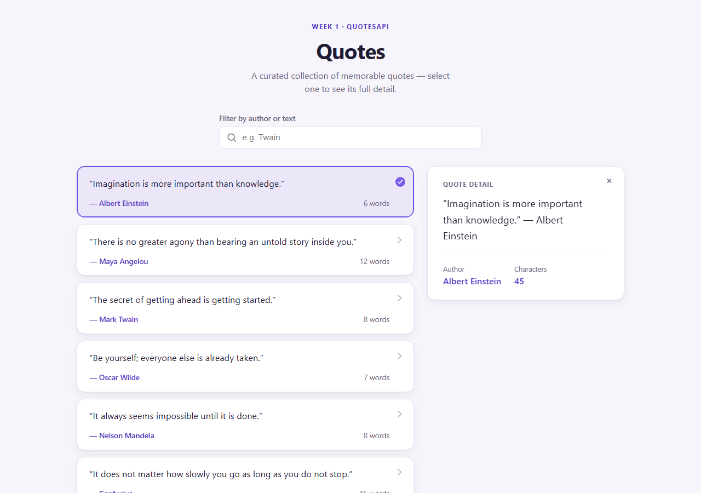
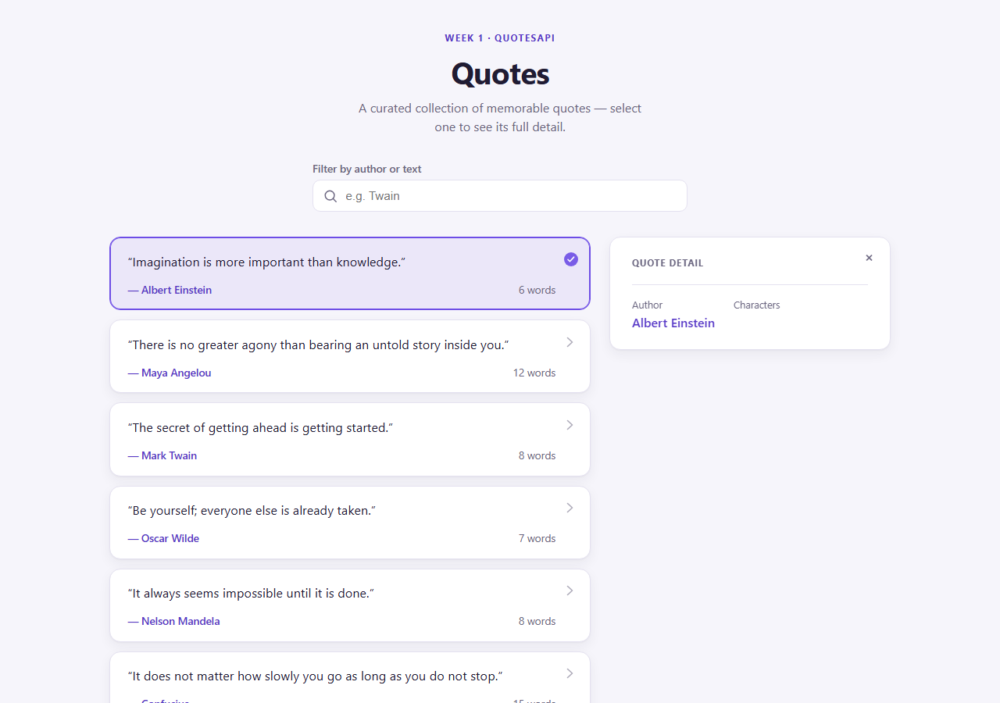

# Day 13 — Task 2: Result

## 1. Exercise (as given)

Build a small Angular feature against a real endpoint from the Week-1 `QuotesApi`, list/detail style:

- List quotes from `GET /api/quotes?page={page}&size={size}` (envelope `{ page, size, total, items }`, each item `{ id, author, text, isDeleted }`).
- Selecting an item loads its detail from a second endpoint, `GET /api/quotes/{id}`.
- Cover loading, error, and empty states for both the list and the detail.
- List/detail interaction: selecting a quote shows its detail alongside the list; selecting the same quote again (or closing) clears the detail.
- Find and fix a real bug: stale requests overwriting newer state when the user paginates or selects quickly.

## 2. What was built

- **Models** (`src/app/quote.ts`): `Quote { id, author, text, isDeleted }`, `QuotesPage { page, size, total, items }`, `QuoteDetail { id, author, text, display, characterCount }` (the last a client-side view model — see §6).
- **Endpoints used** — real Week-1 `QuotesApi` (`day-1/QuotesApi`), confirmed against the actual `Endpoints/QuoteEndpoints.cs` source and by calling the live endpoint with `curl`:
  - `GET http://localhost:5062/api/quotes?page={page}&size={size}` → `{ page, size, total, items: Quote[] }`.
  - `GET http://localhost:5062/api/quotes/{id}` → `{ id, author, text, isDeleted }` (404 if not found) — the same shape as a list item. `display`/`characterCount` do not exist anywhere in the API; an earlier version of this doc claimed they did and cited a nonexistent `Application/Quotes/GetQuoteByIdQuery.cs` file as the source. That file doesn't exist in this repo — the claim was wrong. See §6.
- **`QuotesService`** (`src/app/quotes.service.ts`): thin injectable, `getQuotes(page, size)` and `getQuoteById(id)`, both plain `HttpClient` calls against the base URL above.
- **`App`** (`src/app/app.ts`), standalone component, `inject()`-based DI, signals throughout:
  - List side: `page`, `size`, `quotes`, `total`, `loading`, `error` signals; `totalPages`, `hasPrevious`, `hasNext` computed from `total`/`size`/`page`; `filter` signal with a `filteredQuotes` computed (case-insensitive match on author or text); `viewState` computed to `loading | error | empty | success`.
  - Detail side: `selectedId`, `quoteDetail`, `detailLoading`, `detailError` signals, plus a `detailRequest` signal that represents "the detail currently asked for" and a `detailViewState` computed to `idle | loading | error | success`.
  - `selectQuote(id)` toggles selection (clicking the selected quote again clears it) and updates `detailRequest`; `closeDetail()` clears both.
- **Template** (`app.html`): `@if`/`@else if` on `viewState()` for the list (skeleton list while loading, error panel with Retry, empty panel, or the `@for (quote of filteredQuotes(); track quote.id)` list), and `@switch (detailViewState())` for the detail pane (idle placeholder, skeleton, error panel with Retry, or the detail card with `display`/`author`/`characterCount`).

## 3. Loading / error / empty states

- **Loading** — `loading` signal drives a skeleton-card list (`@if (loading())`); the detail pane has its own skeleton for `detailViewState() === 'loading'`. Both are marked `aria-busy`/`aria-live="polite"` so it's not just visual.
- **Error** — `describeError()` maps a `404` to "No quotes found."/"Quote not found.", a network failure (`status === 0`) to "Unable to reach the server...", and anything else to a generic fallback. Each error panel has its own Retry button (`retry()` for the list, `retryDetail()` for the detail) that just replays the last request.
- **Empty** — when `filteredQuotes().length === 0` (either the API returned nothing for the page, or the filter matched nothing), the list shows an empty-state panel ("No quotes found. / Try a different author or search term.") instead of a blank list.

## 4. List/detail interaction

Clicking a quote card calls `selectQuote(id)`: if it's already selected, selection is cleared (toggle-off); otherwise `selectedId` is set and `detailRequest` is set to `{ id }`, which drives the detail fetch. The detail pane starts at `idle` ("Select a quote") until something is selected, then walks `loading → success`/`error`. Closing the detail (`closeDetail()`, or the `×` button) resets both `selectedId` and `detailRequest` back to `idle`.

## 5. Bug found and fixed: stale requests during rapid pagination/selection

**Bug:** both `loadQuotes` (list) and the detail fetch subscribe to an HTTP `Observable` per request. With no cancellation, clicking Next/Previous quickly, or clicking through several quotes fast, fires overlapping requests. Responses don't necessarily come back in the order they were sent — a slower response for a page/quote the user has already navigated away from can arrive *after* a faster, more recent one and silently overwrite the correct state with stale data. This is the classic race that plain `subscribe()` calls don't guard against.

**Fix, list side** — `loadQuotes()` keeps a `private quotesSubscription?: Subscription` and calls `this.quotesSubscription?.unsubscribe()` before issuing the next request:

```ts
private loadQuotes(page: number, size: number): void {
  this.quotesSubscription?.unsubscribe();
  this.loading.set(true);
  this.error.set(null);
  this.quotesSubscription = this.quotesService.getQuotes(page, size).subscribe({ ... });
}
```

So the in-flight request for a page the user has since paged away from is cancelled and can never resolve into `quotes`/`total`.

**Fix, detail side** — the detail fetch is driven through `toObservable(this.detailRequest).pipe(switchMap(...))` instead of a manual `subscribe()` per click. `switchMap` unsubscribes the previous inner request the moment a new `detailRequest` value arrives, so a slow response for a quote the user has already clicked past never lands on top of the currently-displayed detail. `detailRequest` is always set to a fresh object (not reused), including on retry, so a retry for the same id still triggers a new emission.

## 6. Bug found and fixed: fabricated detail-endpoint contract

**Bug:** the original `QuotesService.getQuoteById` typed the response of `GET /api/quotes/{id}` as `QuoteDetail { id, author, text, display, characterCount }` and returned it as-is. The real endpoint ([`QuoteEndpoints.cs:121-149`](../../day-1/QuotesApi/Endpoints/QuoteEndpoints.cs)) does `Results.Ok(quote)` on the raw `Quote` entity — it returns `{ id, author, text, isDeleted }`, the same shape as a list item. `display` and `characterCount` never existed server-side. An earlier version of this document even cited a specific file, `Application/Quotes/GetQuoteByIdQuery.cs`, as having confirmed the `display`/`characterCount` shape — that file does not exist anywhere in `day-1/QuotesApi`. That citation was fabricated, not a real verification.

**Effect in the running app:** since JSON deserialization silently leaves missing fields `undefined` rather than throwing, the bug didn't surface as an error — the detail panel rendered with a blank quote line and a blank "Characters" value. Confirmed with a screenshot before the fix: `docs/detail-before-fix.png`.

**Fix:** `QuotesService.getQuoteById` now requests the real `Quote` shape and derives `display`/`characterCount` client-side:

```ts
getQuoteById(id: number): Observable<QuoteDetail> {
  return this.http.get<Quote>(`${this.baseUrl}/${id}`).pipe(
    map((quote) => ({
      id: quote.id,
      author: quote.author,
      text: quote.text,
      display: `“${quote.text}” — ${quote.author}`,
      characterCount: quote.text.length
    }))
  );
}
```

Confirmed fixed with a second screenshot: `docs/detail-after-fix.png`, showing the composed quote line and a real character count (45, matching "Imagination is more important than knowledge.".length).

This is the concrete instance of "a field name that doesn't match your real API" the exercise asks to catch — caught by comparing the frontend's assumed contract against the actual endpoint source and a live `curl` call, not by trusting either the original code comment or the file it cited.

## 7. What would break if the API contract changed

- Renaming/restructuring the list envelope (`page`/`size`/`total`/`items`) or the item shape (`id`/`author`/`text`/`isDeleted`) breaks the `Quote`/`QuotesPage` interfaces silently — there's no runtime schema validation, so a mismatch surfaces as `undefined` in the template rather than a compile-time or request-time error. `QuoteDetail` is now insulated from this for `display`/`characterCount` specifically, since those are computed client-side rather than read off the response (see §6) — but `id`/`author`/`text` are still read directly off the API response and would break the same way.
- `QuotesService.baseUrl` is hardcoded to `http://localhost:5062/api/quotes`; moving the API to a different host/port breaks every request.
- `totalPages`/`hasNext`/`hasPrevious` assume `page` is 1-indexed and `total` is the grand total across all pages, not the count on the current page — switching either convention breaks pagination without any error being thrown.
- If the detail endpoint renamed `text` or `author`, `quote.text.length` inside the `map()` would throw on `undefined`, surfacing as the generic "Failed to load quote." error rather than a compile error (the mapping isn't typo-proof against a real rename, just against the fields simply not being sent). If either field started coming back as an empty string instead, `display` would render with a blank half and `characterCount` would silently read `0` — no error, just wrong-looking output.
- The 404-vs-network-failure distinction in `describeError()` depends on `HttpErrorResponse.status`; if the API started returning a different status for "not found" (e.g. 200 with an empty body), the error panel would show the generic fallback message instead of "Quote not found."

## 8. Screenshots (live run)

**List view:**



**Detail bug, before the fix** (blank quote text, blank character count):



Captured with the real stack running end to end:

- `QuotesApi` (`day-1/QuotesApi`) running on `http://localhost:5062`, seeded with 10 quotes via `POST /api/quotes`.
- This app served with `ng serve --port 4202` (4200/4201 were already in use by other exercises' apps running alongside it) and driven with a headless Playwright script (`chromium.launch()` → click the first quote card → screenshot) since no interactive browser session was available in this environment.

Getting this running also required a fix outside this app: `QuotesApi` had no CORS policy configured at all, so the browser silently blocked every request from the Angular dev server's origin even though `curl` worked fine. Fixed with a `Development`-only CORS policy in `QuotesApi`'s `Program.cs`/`InfrastructureExtensions.cs` that allows local dev origins — not part of this app's code, but required to demonstrate it live.
