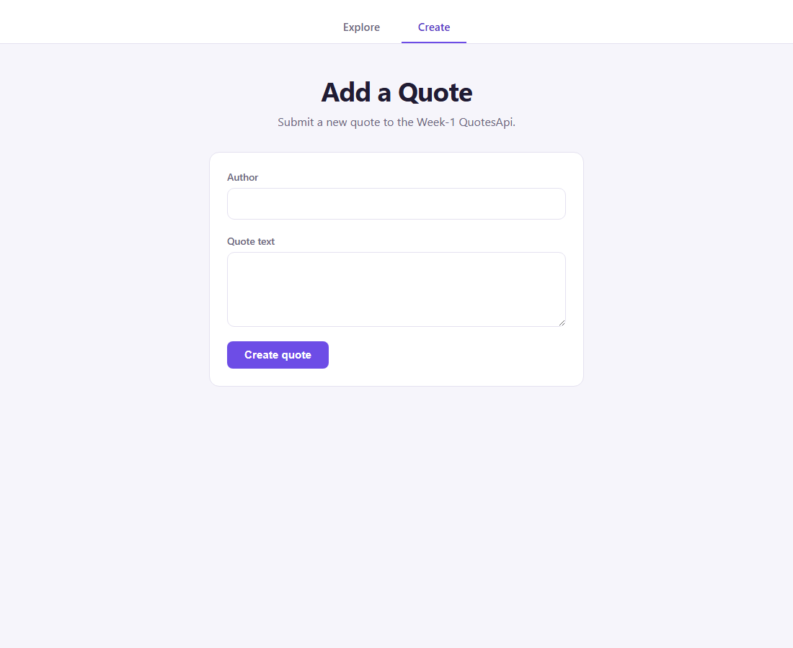
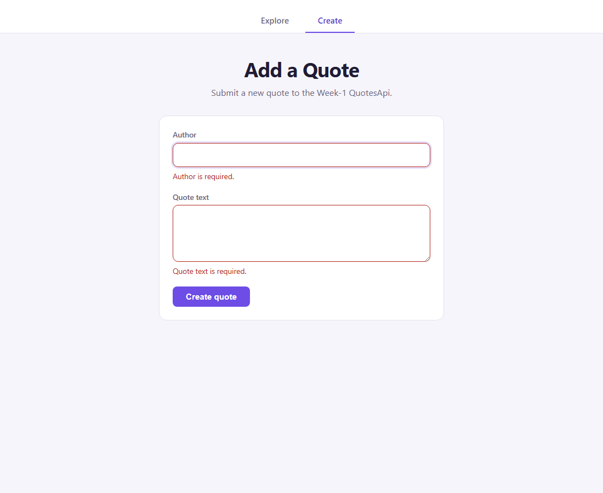
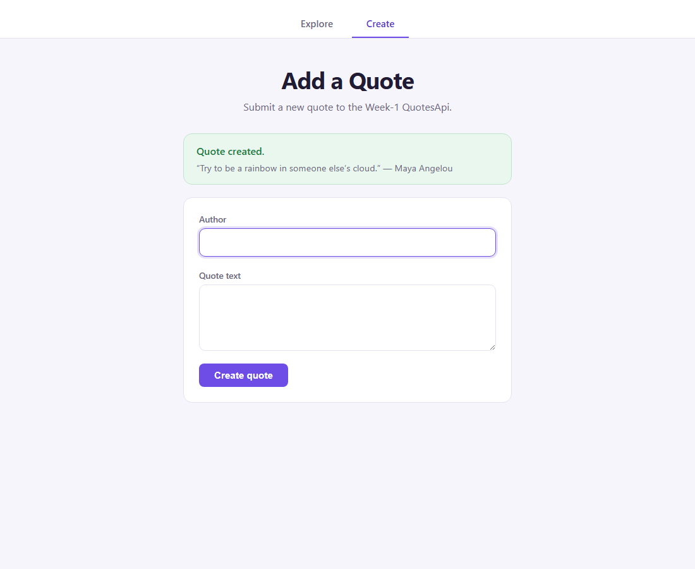

# Day 14 — Task 1: Add a Quote (Angular reactive form)

Standalone Angular component that submits a new quote to the Week-1 `QuotesApi`, built with Angular reactive forms — validation, error messages, and focus management driven from a typed `FormGroup`, state (submitting/success/error) held in signals.

Reached via a nav bar with two tabs, **Explore** and **Create** (`app.routes.ts`): Explore is Day-13/task-2's list/detail view, ported in afterward; Create is this form. Both share the `QuotesService`/`Quote` models in this project.

## API contract

`POST http://localhost:5062/api/quotes` (Week-1 `QuotesApi`, see `day-1/QuotesApi`).

Request body:

```json
{ "author": "Marcus Aurelius", "text": "You have power over your mind, not outside events." }
```

- `author` — required, 1–200 characters (`[Required, StringLength(200, MinimumLength = 1)]` in `DTOs/QuoteRequests.cs`).
- `text` — required, 1–1000 characters (`[Required, StringLength(1000, MinimumLength = 1)]`).
- Whitespace-only values are also rejected: .NET's `[Required]` attribute trims before checking length, and `Models/Quote.cs` re-checks `IsNullOrWhiteSpace` in the domain layer.

Success response — `201 Created`:

```json
{ "id": 1, "author": "Marcus Aurelius", "text": "You have power over your mind, not outside events.", "isDeleted": false }
```

Failure responses actually returned by the endpoint:
- `400` — either a validation problem (`{ errors: { Field: [message, ...] } }`) from `ValidationExtensions.Validate`, or a `ProblemDetails` (`{ title, detail }`) from the domain-level `ArgumentException` catch.
- `401`/`403` — the endpoint is `.RequireAuthorization(PermissionClaims.CanEditQuotes)`; no anonymous POST.

## Auth (dev-only)

The endpoint above requires a bearer token with the `CanEditQuotes` claim, and this app has no login screen. Rather than build one for a forms/a11y exercise, `app.config.ts` logs in as `QuotesApi`'s own seeded test user (`day-1/QuotesApi/Data/DbSeeder.cs`, `ayush.test@example.com`) via a `provideAppInitializer` before the app starts, and `auth.interceptor.ts` attaches the resulting token to every request to `http://localhost:5062/api/*`. The token lives only in an in-memory signal (`auth.service.ts`) — nothing is persisted to `localStorage`/`sessionStorage`, so a page refresh logs in again. This is explicitly a dev convenience, not a real auth flow — see `result.md` §8.

## Implementation

- `src/app/quote.ts` — `Quote` (response shape: `id`, `author`, `text`, `isDeleted`) and `CreateQuoteRequest` (`author`, `text`), matching the DTOs above exactly.
- `src/app/quotes.service.ts` — `QuotesService.createQuote()`, `HttpClient.post<Quote>` against the same `http://localhost:5062/api/quotes` base URL Day-13's `QuotesService` already uses.
- `src/app/app.ts` — the standalone root component:
  - `form: FormGroup<{ author: FormControl<string>; text: FormControl<string> }>`, built with `formBuilder.nonNullable.group(...)`.
  - Validators: `Validators.required`, a custom `notBlank` (rejects whitespace-only, since Angular's own `required` doesn't trim), `Validators.maxLength(200)` / `maxLength(1000)`.
  - Signals: `submitting`, `submitError`, `created`; a `status` computed (`idle | submitting | success | error`) drives which panel shows.
  - `submit()` — guards against duplicate submission, focuses the first invalid field on a failed validation attempt, posts the trimmed values, and on success resets the form and refocuses the author field.
  - `extractServerError()` — reads the real error body back from the API (validation `errors` map, `ProblemDetails.detail`/`.title`, or a network/auth fallback) instead of showing a made-up message.
- `src/app/app.html` / `app.css` — the form markup and styling, following Day-13's color tokens/layout conventions.

## Validation and accessibility

- Every field has a `<label for>` matching the input's `id`.
- `[attr.aria-invalid]` is set explicitly to `"true"`/`"false"` on both fields.
- `[attr.aria-describedby]` points at the field's error `<p role="alert">` id when invalid, and is removed otherwise.
- Native `maxlength` attributes mirror the same 200/1000 limits as the validators.
- Failing to submit an invalid form calls `markAllAsTouched()` and moves focus to the first invalid field (`viewChild` + `ElementRef`, author before text).
- The submit button disables and its label changes to "Creating…" while a request is in flight; the section is wrapped in `aria-live="polite"` with a visually-hidden status line so screen readers hear it too.
- Duplicate submission is prevented purely by the `submitting()` signal guard at the top of `submit()` plus the button's `disabled` binding — nothing else is disabled during the request, so keyboard focus stays put.

## Verification

Three passes, documented in full in `result.md`:

1. **Source-level review** (no dev server running yet) — every field/route/limit checked against the live `day-1/QuotesApi` source and its integration tests. Caught one real bug: a `form.disable()`/`form.enable()` pair that looked like extra duplicate-submit protection but actually blurred focus off the field the user was typing in when they submitted via Enter (a disabled control loses focus per the HTML spec). Removed — the `submitting()` guard and the button's `disabled` binding were already sufficient.
2. **Live, keyboard-driven pass with axe** (before the auth fix) — found that every real submission through this UI got a genuine `401`, because the app never attached an `Authorization` header anywhere. Also ran an `axe-core` scan that caught one real accessibility bug (missing `<main>` landmark), fixed and re-scanned clean.
3. **Live pass again, after adding the dev-only auth flow** (see "Auth" above) — the same keyboard-only script now gets a real `201`, the quote is actually persisted (`GET /api/quotes` total went `10 → 11`), the success panel renders correctly, the form resets, and focus returns to the author field. Re-ran axe on this state too: 0 violations.

### Screenshots (live run, after the auth fix)

| Empty | Invalid (keyboard submit) | Success (real 201, persisted) |
|---|---|---|
|  |  |  |

See `result.md` §6–8 for the full verification log, the auth fix, and the accessibility bug caught and fixed.

## How to run it

Needs the Week-1 `QuotesApi` running locally on `http://localhost:5062` first (see `day-1/QuotesApi`) — the app logs in as its seeded test user automatically on start (see "Auth" above), so no manual login step is needed.

```bash
npm install
ng serve
```

Then open `http://localhost:4200/`.
