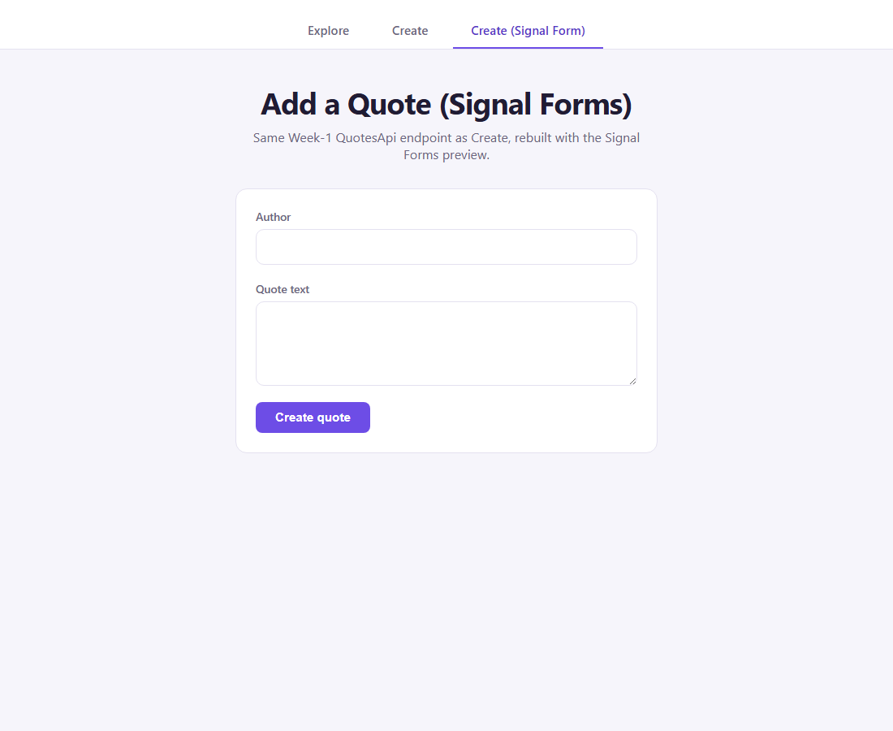
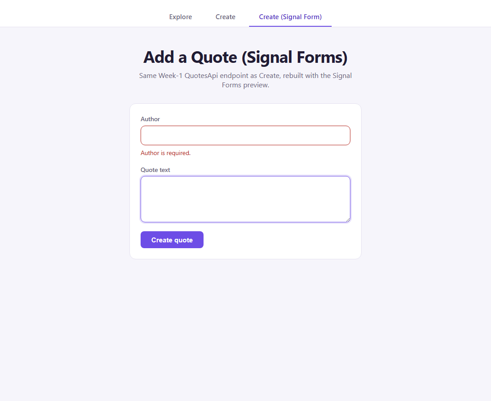
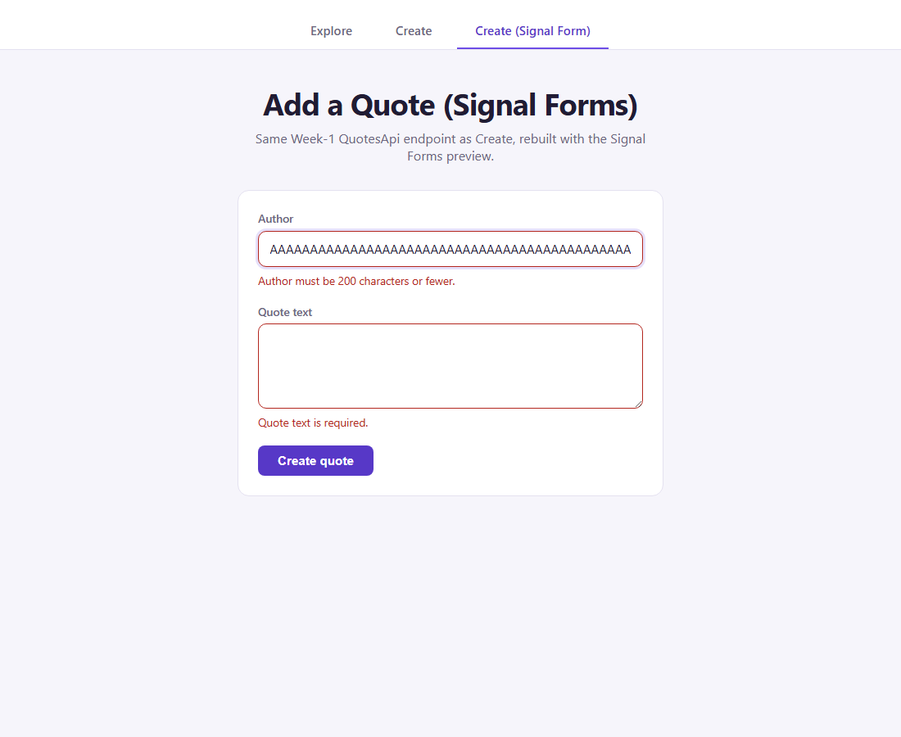
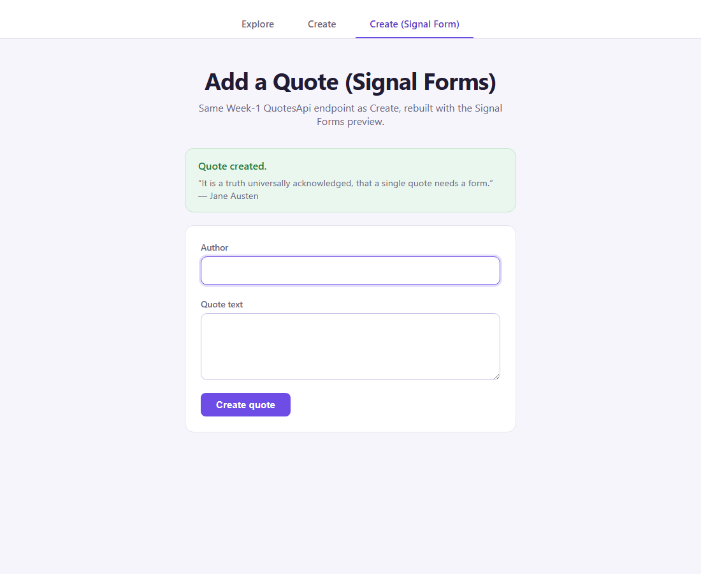
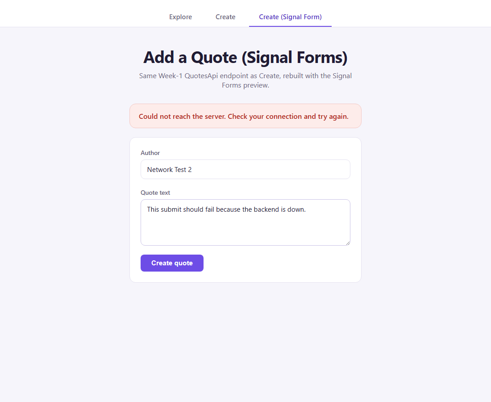

# Day 14 — Task 2: Add a Quote (Signal Forms preview)

Everything in Day-14/task-1 (Explore, Create), plus a third tab — **Create (Signal Form)** — that rebuilds the same create-a-quote form against the same real Week-1 endpoint using Angular's **Signal Forms preview** (`@angular/forms/signals`), instead of `ReactiveFormsModule`.

This project started as a full copy of `Day-14/task-1` (same Explore/Create tabs, same auth, same routing, same styling tokens), with the Signal Forms tab added on top. Nothing in the copied Explore/Create code was changed.

## API contract

Identical to task-1 — same endpoint, same fields, same limits, because this is a rebuild of the *form*, not a new integration:

`POST http://localhost:5062/api/quotes` (Week-1 `QuotesApi`, see `day-1/QuotesApi`).

```json
{ "author": "Marcus Aurelius", "text": "You have power over your mind, not outside events." }
```

- `author` — required, 1–200 characters (`[Required, StringLength(200, MinimumLength = 1)]` in `DTOs/QuoteRequests.cs`).
- `text` — required, 1–1000 characters (`[Required, StringLength(1000, MinimumLength = 1)]`).
- Whitespace-only values are rejected server-side too (.NET's `[Required]` trims before checking length).
- `201 Created` → `{ id, author, text, isDeleted }`. `400` → validation problem or `ProblemDetails`. `401`/`403` → the endpoint requires the `CanEditQuotes` claim.

## Auth (dev-only)

Same dev-only login-as-seeded-user flow as task-1 (`app.config.ts`, `auth.service.ts`, `auth.interceptor.ts`) — copied over unchanged. See task-1's README for the details; not repeated here since nothing about it changed for this exercise.

## Signal Forms implementation

`src/app/create-signal/` — the new tab:

- **`create-signal.ts`** — `form()` wraps a plain `signal<{author: string; text: string}>` (no `FormBuilder`/`FormGroup`). Validators are schema rules (`required()`, a custom `validate()` for whitespace-only, `maxLength()`), applied inside the second argument to `form()`. Submission is configured as `{ submission: { action, onInvalid } }` in the third argument — `<form [formRoot]="quoteForm">` in the template then handles the actual submit event itself, no `(ngSubmit)` handler needed.
- **`create-signal.html`** — `[formField]="quoteForm.author"` / `[formField]="quoteForm.text"` bind the native `<input>`/`<textarea>` to their fields. `aria-invalid`/`aria-describedby` are still hand-wired with `[attr.*]`, same as the reactive version — Signal Forms does **not** wire ARIA automatically for native elements (see `result.md` §7).
- **`create-signal.css`** — copied verbatim from `create.css`. Visually identical to the reactive form on purpose, so the comparison is about the forms layer, not the design.

Reached via the third nav tab, "Create (Signal Form)" (`app.routes.ts` → `/create-signal`).

## Real API confirmed before writing code

Signal Forms is a **developer preview** — every export in the installed `@angular/forms@21.2.21` carries an `@experimental` tag. Before writing the component, the actual shipped `.d.ts` and compiled `.mjs` were read directly (not assumed from general "signal forms" knowledge, which mostly describes older, unstable snapshots of this API). This caught a real, concrete mismatch before any code was written: the binding directive in this installed version is **`[formField]`**, not `[field]` — `Field` exists only as a type, not a runtime directive. See `result.md` §2 for the exact evidence (type re-export list vs. the real `.mjs` export list disagree on this).

## Verification

Driven live end to end (keyboard input only) against `day-1/QuotesApi` running on `localhost:5062`, this app on `localhost:4203`. Full log and reasoning in `result.md` §4–6. Two real bugs were caught and fixed, not just found and described:

1. **Compiler-caught**: binding `[attr.maxlength]` manually alongside `[formField]` doesn't compile (`NG8022`) — `[formField]` already drives the native `maxlength` attribute from the `maxLength()` schema rule. Fixed by removing the manual binding; confirmed the native attribute is still genuinely present afterward.
2. **Screenshot-caught**: after a successful submit, `model.set({author:'', text:''})` cleared the *value* but not the fields' touched/dirty state, so the freshly-emptied required fields immediately showed "required" errors right next to the success panel. Fixed with `quoteForm().reset({author:'', text:''})`, which clears both. See the before/after in `result.md` §6.

### Screenshots (live run)

| Pristine | Dirty + touched, required firing | Invalid submit (focus-first-invalid) |
|---|---|---|
|  |  |  |

| Clean submit (real 201) | Failed submit (real network error) |
|---|---|
|  |  |

Also ran `axe-core` against the success-state DOM: **0 violations**.

## How to run it

Needs the Week-1 `QuotesApi` running locally on `http://localhost:5062` first (see `day-1/QuotesApi`) — the app logs in as its seeded test user automatically on start (same as task-1).

```bash
npm install
ng serve
```

Then open `http://localhost:4200/` (or whichever port `ng serve` picks if others are already running) and go to the "Create (Signal Form)" tab.
