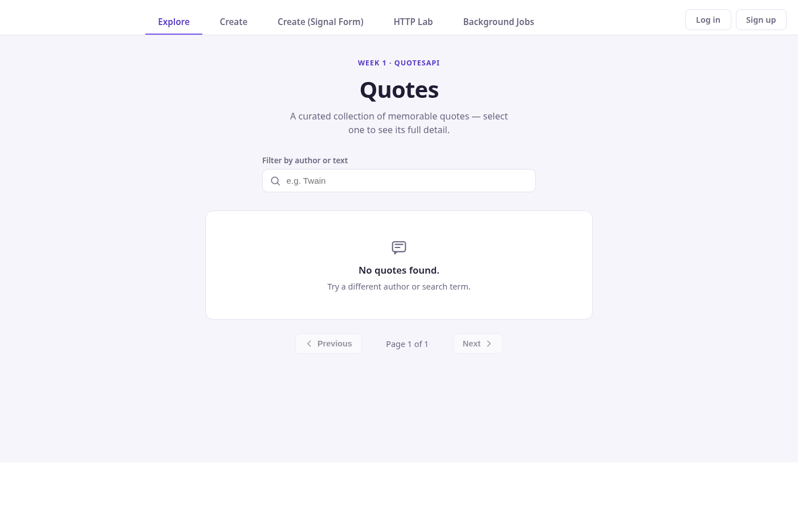
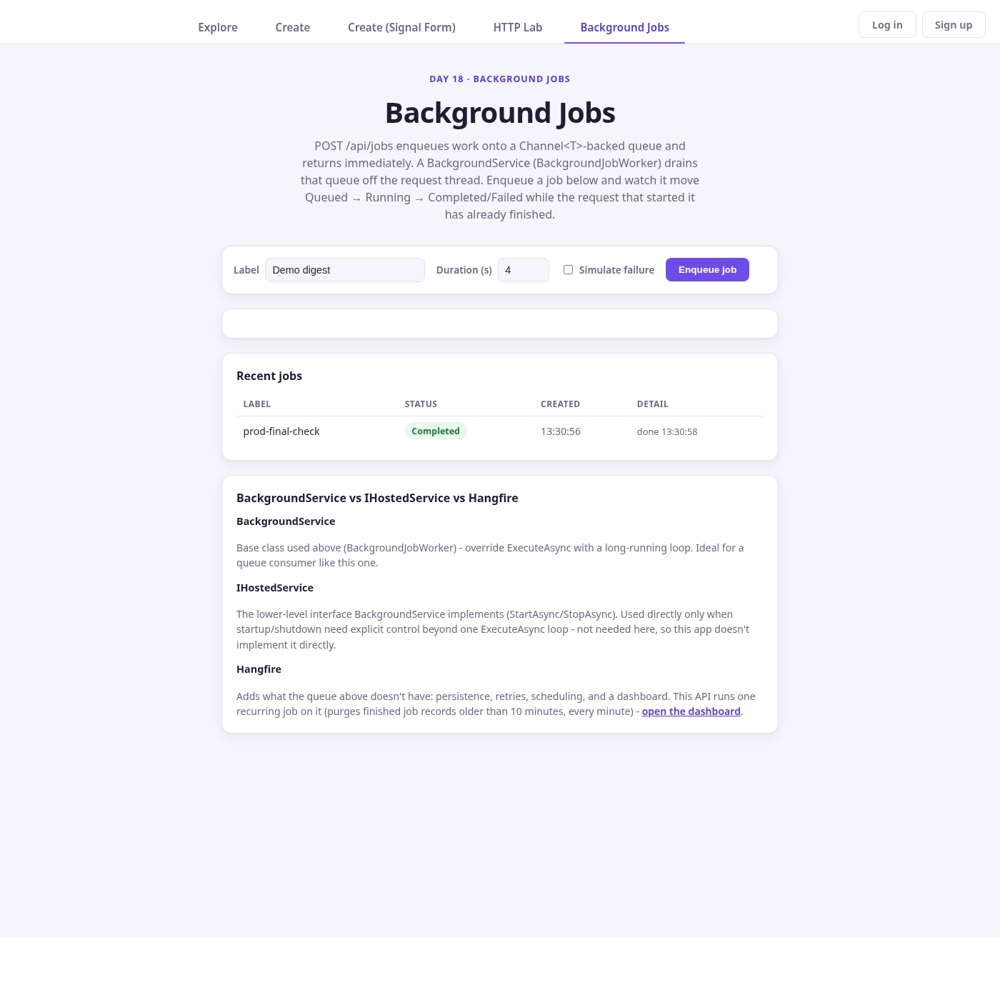
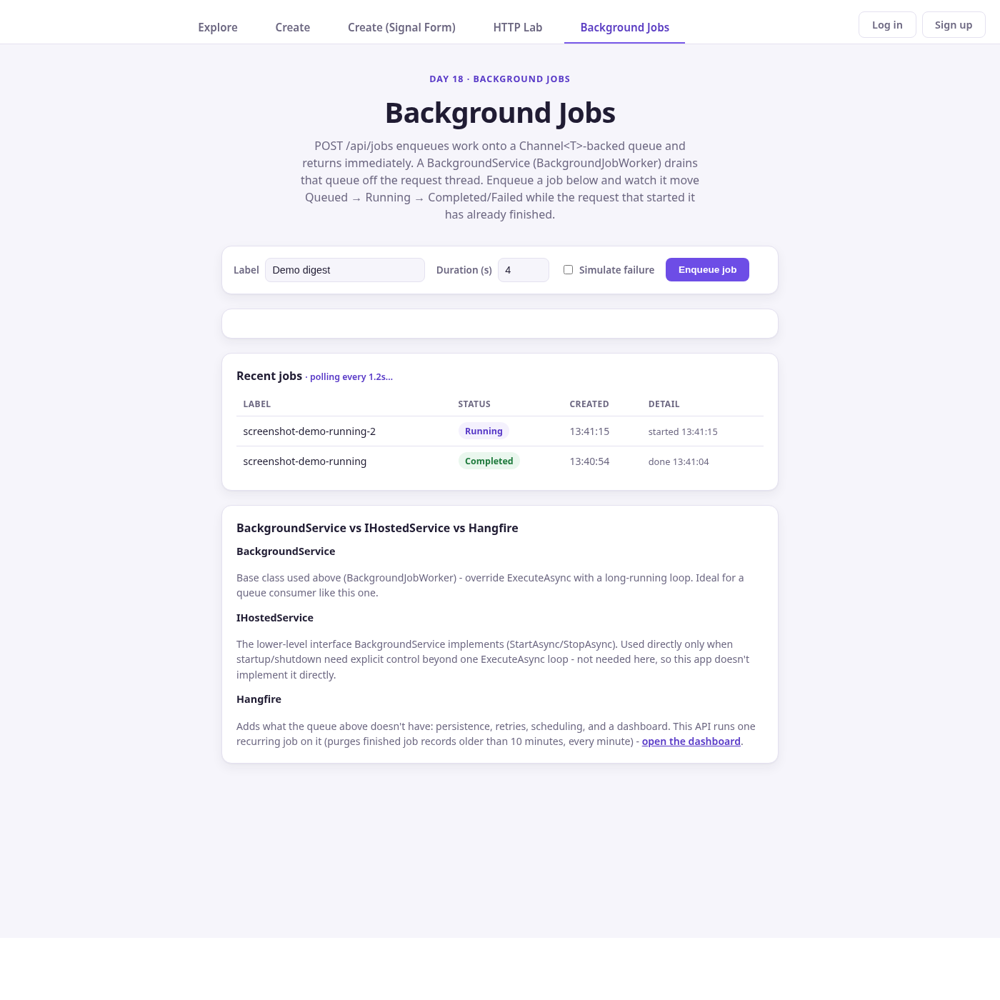
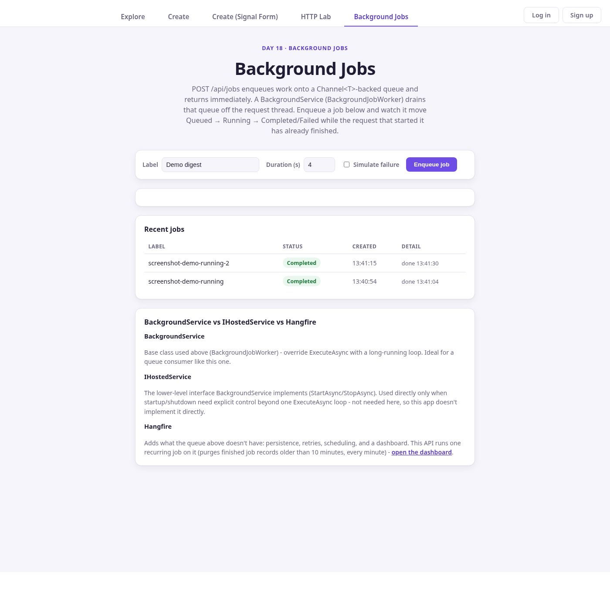
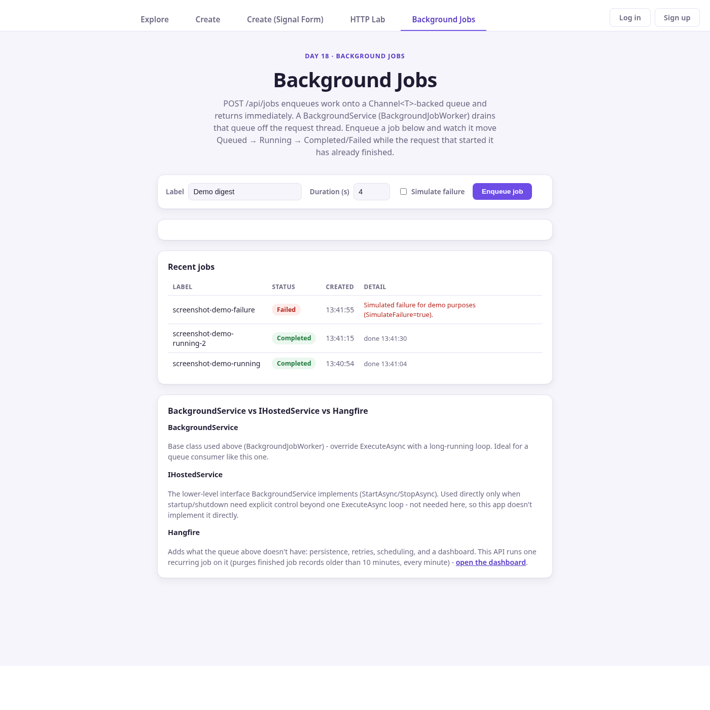

# Day 18 — Background Jobs — Result

## Exercise

> Move slow work off the request thread. Implement a BackgroundService that
> drains a queue, and contrast it with IHostedService and Hangfire for
> scheduled work. Handle graceful shutdown via the cancellation token.

**Exercise:** Paste the BackgroundService + how it shuts down cleanly. One
line: when Hangfire over a hosted service?

## Brief

Add a demo endpoint (`POST /api/jobs`) that hands slow, simulated work to a
queue and returns immediately, a single `BackgroundService` that drains that
queue off the request thread, and a small Hangfire setup that does the one
thing the queue deliberately doesn't: durable, scheduled work. Everything
lives in the existing `day-1/QuotesApi` backend and the existing
`Day-16/task-2` Angular app — no new project, no new Angular app.

## BackgroundService

`day-1/QuotesApi/Jobs/BackgroundJobWorker.cs`:

```csharp
public sealed class BackgroundJobWorker(
    IBackgroundTaskQueue queue,
    IServiceScopeFactory scopeFactory,
    ILogger<BackgroundJobWorker> logger) : BackgroundService
{
    protected override async Task ExecuteAsync(CancellationToken stoppingToken)
    {
        logger.LogInformation("Background job worker started");

        while (!stoppingToken.IsCancellationRequested)
        {
            BackgroundWorkItem workItem;

            try
            {
                // Suspends asynchronously (no polling, no Thread.Sleep) until
                // either a job is enqueued or stoppingToken is cancelled.
                workItem = await queue.DequeueAsync(stoppingToken);
            }
            catch (OperationCanceledException) when (stoppingToken.IsCancellationRequested)
            {
                break; // graceful shutdown - not an error
            }

            await using var scope = scopeFactory.CreateAsyncScope();

            try
            {
                await workItem(scope.ServiceProvider, stoppingToken);
            }
            catch (OperationCanceledException) when (stoppingToken.IsCancellationRequested)
            {
                break; // the job itself was cancelled mid-flight by shutdown
            }
            catch (Exception ex)
            {
                // one bad job must never kill the worker for every job queued after it
                logger.LogError(ex, "Unhandled exception from a background work item");
            }
        }

        logger.LogInformation("Background job worker stopping");
    }
}
```

## Queue

`day-1/QuotesApi/Jobs/BackgroundTaskQueue.cs` — a `Channel<BackgroundWorkItem>`
(unbounded; see "Bug Found and Fixed" below), registered as a singleton
shared by every request thread that enqueues and the one worker that drains:

```csharp
public sealed class BackgroundTaskQueue : IBackgroundTaskQueue
{
    private readonly Channel<BackgroundWorkItem> _channel = Channel.CreateUnbounded<BackgroundWorkItem>();

    public async ValueTask QueueBackgroundWorkItemAsync(BackgroundWorkItem workItem) =>
        await _channel.Writer.WriteAsync(workItem);

    public async ValueTask<BackgroundWorkItem> DequeueAsync(CancellationToken cancellationToken) =>
        await _channel.Reader.ReadAsync(cancellationToken);
}
```

`BackgroundWorkItem` is `delegate Task BackgroundWorkItem(IServiceProvider services, CancellationToken cancellationToken)`
— the endpoint closes over the job's id and parameters, and resolves scoped
services (like `IJobStore`) from the `IServiceProvider` the worker hands it
per item, not from the request's own container.

`POST /api/jobs` (`day-1/QuotesApi/Endpoints/JobEndpoints.cs`) creates the job
record as `Queued`, calls `QueueBackgroundWorkItemAsync`, and returns
`202 Accepted` — the work item (which moves the job to `Running`, awaits
`Task.Delay(durationSeconds)`, then `Completed` or `Failed`) doesn't run
until `BackgroundJobWorker` dequeues it, on its own time, off the request
thread.

## Graceful Shutdown

`BackgroundService` implements `IHostedService.StopAsync` for you: the host
signals the `CancellationToken` passed into `ExecuteAsync` and then awaits the
running task, up to `HostOptions.ShutdownTimeout`. Two places in the worker
observe that token instead of ignoring it:

1. `await queue.DequeueAsync(stoppingToken)` — this is where the worker
   spends nearly all its life (parked on an empty queue). Cancelling
   `stoppingToken` makes the underlying `Channel<T>.Reader.ReadAsync` throw
   `OperationCanceledException` immediately rather than waiting for a job
   that may never arrive — no polling loop, no `Thread.Sleep`.
2. `await workItem(scope.ServiceProvider, stoppingToken)` — the same token is
   handed to the job itself, so a job mid-`Task.Delay` also unblocks on
   shutdown instead of running to completion regardless.

Both cases are caught specifically as
`catch (OperationCanceledException) when (stoppingToken.IsCancellationRequested)`
and `break` the loop — treated as normal shutdown, not a job failure. A
scoped `IServiceScopeFactory.CreateAsyncScope()` is created per work item
(never a scoped dependency injected straight into the singleton worker), so
whatever a job resolves (e.g. `AppDbContext`, were a job to need one) is
disposed with that scope regardless of how the item finished.

## IHostedService vs BackgroundService vs Hangfire

- **IHostedService** — the interface itself: `StartAsync`/`StopAsync`,
  called once each by the host. `BackgroundService` implements it; this app
  never implements it directly because one `ExecuteAsync` loop is enough.
- **BackgroundService** — the base class used here. Convenient over
  `IHostedService` for exactly this shape of work: a loop that runs for the
  app's lifetime and reacts to a single cancellation token.
- **Hangfire** — configured in `BackgroundJobsExtensions.cs`
  (`AddHangfire(...UseInMemoryStorage())`, `AddHangfireServer()`) for one
  recurring job: `RecurringJob.AddOrUpdate<IJobStore>("purge-finished-jobs",
  js => js.PurgeFinishedOlderThan(TimeSpan.FromMinutes(10)), Cron.Minutely)`.
  This is durable (given real storage), retried on failure, and visible on
  `/hangfire` — none of which the queue above has, and none of which the
  queue above needs for "run this once, right now, off the request thread."

**One line:** reach for Hangfire over a plain hosted service when the work
has to survive a restart, retry on failure, run on a recurring schedule, or
be visible to an operator on a dashboard — the ad-hoc queue stays on
`BackgroundService`.

## API

| Method | Route | Behavior |
|---|---|---|
| `POST` | `/api/jobs` | Body `{ label?, durationSeconds (1-20), simulateFailure? }`. Creates the job as `Queued`, enqueues the work item, returns `202 Accepted` with `Location: /api/jobs/{id}`. |
| `GET` | `/api/jobs` | Most recent 20 jobs, newest first. |
| `GET` | `/api/jobs/{id}` | `404` if unknown, else the current `JobRecord`. |
| `GET` | `/hangfire` | Dashboard; shows the recurring cleanup job. |

## UI

`Day-16/task-2/src/app/jobs/jobs.ts` (+ `.html`/`.css`), routed at `/jobs`
(lazy-loaded, `app.routes.ts`) and linked from the existing nav
(`app.html`). Reuses the app's `HttpClient` + interceptor stack via
`JobsService` (`../jobs.service.ts`), and its signal-based component style —
no separate Angular app, no duplicated HTTP/error-handling code.

The page:

- has a form to enqueue a job (label, duration, simulate-failure checkbox);
- times the `POST` itself with `performance.now()` and shows the round-trip
  in milliseconds — the actual evidence that the request returned before the
  job finished, not a claim;
- polls `GET /api/jobs` every 1.2s (`interval` + `switchMap`, torn down via
  `takeUntilDestroyed` when the component is destroyed) and renders each
  job's `Queued`/`Running`/`Completed`/`Failed` status, with the failure
  message shown inline for `Failed` jobs;
- links to `/hangfire` and explains the BackgroundService/IHostedService/
  Hangfire contrast on the page itself.

## Files

The app runs from its canonical locations — `day-1/QuotesApi` (backend) and
`Day-16/task-2` (frontend) — and those stay the source of truth. Every file
genuinely specific to Day 18 (7 backend `Jobs/` files, `JobEndpoints.cs`,
`BackgroundJobsExtensions.cs`, `DTOs/JobRequests.cs`, 3 backend test files,
the 4 frontend `jobs/` files, `job.ts`, `jobs.service.ts`) plus the 3 backend
and 2 frontend shared files that Day 18 touched (`Program.cs`,
`InfrastructureExtensions.cs`, `QuotesApi.csproj`, `app.routes.ts`,
`app.html`) is also copied unmodified into `Day-18/src/backend/` and
`Day-18/src/frontend/` so this folder is self-contained for review — full
mapping and which part of each shared file is actually Day-18's is in
`README.md` "Files". Edits belong at the canonical path; the copies here are
a snapshot, not a second live location.

## Verification Log

Ran against the real backend (`dotnet run`, `http://localhost:5062`) and the
real Angular dev server (`ng serve`, `http://localhost:4200`) — not mocked.

**Request returns before the job finishes** (`curl -w`, precise timing):

```
$ curl -s -o resp.json -w "HTTP %{http_code} in %{time_total}s\n" \
    -X POST http://localhost:5062/api/jobs \
    -d '{"label":"verify-timing","durationSeconds":5,"simulateFailure":false}'
HTTP 202 in 0.005350s
{"id":"7ae86411-...","label":"verify-timing","status":"Queued", ...}
```

A `202` in 5ms for a job declared to take 5 seconds — the request thread was
never blocked on the work.

**Multiple jobs, processed safely, one worker, in order** — five jobs plus
one forced failure enqueued back-to-back, then polled after they all
finished:

| Job | Enqueued (UTC) | Started | Completed | Status |
|---|---|---|---|---|
| verify-timing (5s) | 07:03:24.868 | 07:03:24.868 | 07:03:29.869 | Completed |
| multi-1 (2s) | 07:03:24.882 | 07:03:29.869 | 07:03:31.869 | Completed |
| multi-2 (2s) | 07:03:24.935 | 07:03:31.870 | 07:03:33.870 | Completed |
| multi-3 (2s) | 07:03:24.979 | 07:03:33.870 | 07:03:35.871 | Completed |
| multi-4 (2s) | 07:03:25.086 | 07:03:35.872 | 07:03:37.872 | Completed |
| multi-5 (2s) | 07:03:25.164 | 07:03:37.872 | 07:03:39.873 | Completed |
| verify-fail (1s, simulateFailure) | 07:03:25.251 | 07:03:39.873 | 07:03:40.870 | **Failed** — error: "Simulated failure for demo purposes (SimulateFailure=true)." |

Every job was accepted the instant it was posted (all six requests completed
in well under a second, back-to-back); the table above shows them running
strictly one after another, each starting the instant the previous one
finished — exactly what one `BackgroundJobWorker` instance draining a FIFO
channel should do. The failure case landed in `Failed` with the real
exception message attached, not silently swallowed and not marked
`Completed`.

**Graceful shutdown** — enqueued a 15-second job, then sent `SIGTERM` to the
running process:

```
[12:33:57 INF] Enqueued job e33ffc5b-... (shutdown-test, 15s, simulateFailure=False)
$ kill -TERM 9742
[12:34:15 INF] Server kali:9742:488b6565 caught stopping signal...
[12:34:15 INF] Application is shutting down...
[12:34:15 INF] Server kali:9742:488b6565 All dispatchers stopped
[12:34:15 INF] Server kali:9742:488b6565 has been stopped in total 7.9554 ms
[12:34:15 INF] Background job worker stopping
```

The process exited within about a second of the signal (polled with
`kill -0` in a loop; gone by the second 0.5s check), `Background job worker
stopping` confirms `stoppingToken` reached `ExecuteAsync` and the loop broke
out cleanly, and `pgrep` after exit found no leftover `QuotesApi` process —
no orphaned background task. Hangfire's own server (also a hosted service)
shut down in the same pass, in ~8ms.

**Unit tests** — focused run, `Tests.Domain/Jobs/` only:

```
$ dotnet test --filter "FullyQualifiedName~Jobs"
Passed! - Failed: 0, Passed: 15, Skipped: 0, Total: 15, Duration: 270 ms
```

Covers: FIFO ordering, the unbounded-queue regression (below), cancellation
on an already-cancelled token, the worker draining a queued item end to end,
one work item's unhandled exception not stopping the next item from running,
and `StopAsync` completing promptly while parked on an empty queue.

**Frontend tests** — `ng test` (this app's full Vitest suite, five spec
files including `jobs.spec.ts`):

```
Test Files  5 passed (5)
     Tests  23 passed (23)
```

`jobs.spec.ts` drives the real `Jobs` component against a mocked
`HttpClient` (jsdom, no live backend, fake timers for the poll interval) and
asserts: the recent-jobs table renders from `GET /api/jobs`; the request
timing line appears and the just-enqueued job shows `Queued` (not
`Completed`) immediately after `POST` resolves; a `400` from the backend
renders its `detail` message; polling continues on the fixed interval while
the component is alive.

**Backend build**: `dotnet build` — Build succeeded, 0 errors (2 pre-existing
NuGet advisory warnings, unrelated to this day's code).

## Bug Found and Fixed

`BackgroundTaskQueue` originally wrapped `Channel.CreateBounded<BackgroundWorkItem>(32)`
with the default `FullMode` (`Wait`). Once the channel filled — a burst of
more than 32 in-flight jobs past whatever the single worker had already
drained — `QueueBackgroundWorkItemAsync`, awaited directly on the request
thread inside `POST /api/jobs`, stopped completing until the worker freed a
slot. That is the exact thing requirement 2 ("the request returns without
waiting for slow work") rules out: a request past the 32nd in-flight job
would block for as long as it took the worker to drain down to it, one job
duration at a time.

**Fix:** switched to `Channel.CreateUnbounded<BackgroundWorkItem>()`.
Writing to an unbounded channel never blocks the writer, so every request
returns immediately regardless of how deep the backlog is. The trade-off —
a runaway producer could grow the queue's memory without bound — is called
out explicitly (see README "What Would Break This") rather than hidden; it's
the kind of limit a durable queue, or Hangfire's own persisted enqueue, is
for.

**Regression test** (`BackgroundTaskQueueTests.DequeueAsync_DoesNotBlockEnqueue_EvenUnderABurstFarBeyondAnyBoundedCapacity`):
enqueues 500 items with nothing draining the channel and asserts this
completes well inside a 5-second timeout — a bounded channel of capacity 32
would hang indefinitely under the same load.

## Deployment (Azure)

Deployed live, the same way Day 17 deployed the frontend — a manual,
one-off `dotnet publish`/`az containerapp update` and `swa deploy` from a
developer machine, no CI/CD pipeline (see Day 17's `result.md` §"CI/CD,
honestly stated" for why there isn't one).

| Resource | Live URL |
|---|---|
| Backend — Container App `quotes-api` (`thinkschool-rg`) | https://quotes-api.politeocean-3efec37e.centralindia.azurecontainerapps.io |
| Frontend — Static Web App `thinkschool-ayush-swa` (`thinkschool-rg`) | https://polite-mushroom-04dd5ce00.7.azurestaticapps.net |

**Backend**, 2026-08-31 ~08:00 UTC: `dotnet publish -c Release -r linux-x64
/t:PublishContainer -p:ContainerRegistry=cr2i2oapij4zsrc.azurecr.io
-p:ContainerRepository=quotes-api/quotes-api-quotesapi-thinkschool
-p:ContainerImageTag=day18-background-jobs-1788162544` (image pushed to the
existing ACR), then `az containerapp update -n quotes-api -g thinkschool-rg
--image cr2i2oapij4zsrc.azurecr.io/quotes-api/quotes-api-quotesapi-thinkschool:day18-background-jobs-1788162544`.
New revision `quotes-api--0000004` came up healthy at 100% traffic.

**Frontend**: `ng build --configuration production` under Node 22 (`nvm use
22` — the system default Node 18 is below Angular's minimum and fails
silently in a way that leaves a stale `dist/` behind; verified the fresh
build's `apiBaseUrl` was the production Azure URL, not `localhost`, before
deploying — a real mistake caught mid-session, see below), then
`swa deploy dist/task-1/browser --deployment-token <fetched via az
staticwebapp secrets list, never printed> --env production`.

**A real mistake, caught and fixed in this pass:** the first deploy attempt
used a stale local `dist/` left over from an earlier dev-mode build (its
`environment.ts` bundled `apiBaseUrl: "http://localhost:5062"`) because
`ng build --configuration production` had failed silently under the
system's default Node 18 and the deploy step ran anyway against the old
output. That got redeployed to the live Static Web App for a few minutes.
Caught by grepping the deployed JS bundle for `apiBaseUrl` right after
publishing, rebuilt properly under Node 22 with the production
configuration confirmed pointing at the real Azure API before redeploying,
and reverified.

**Live verification** (production URLs, not local):
- `GET https://quotes-api.../api/jobs` → `200`.
- `POST https://quotes-api.../api/jobs` (`prod-verify`, 3s) → `202` in
  0.24s, then polled to `Completed`.
- `POST .../api/jobs` again (`prod-final-check`, 2s) → `202`, confirming
  the fix redeploy didn't regress anything.
- `https://polite-mushroom-.../` serves `main-BBAXKNPY.js`, which pulls in
  `chunk-CZNCSJTH.js` — grepped directly off the live site and confirmed it
  contains `apiBaseUrl:"https://quotes-api...azurecontainerapps.io"`, not
  `localhost`.
- `https://polite-mushroom-.../jobs` → `200`; its lazy `jobs` chunk
  (`chunk-WG3IZYNS.js`) → `200` from the live site.

**Known gap, called out rather than hidden:** `JobStore` and Hangfire both
use in-memory storage (see "What Would Break This" below) — every
Container App restart or scale-to-zero event on the live deployment loses
job history and the Hangfire schedule, exactly as it would locally. Fine
for this demo; not a claim of durability in production.

## Screenshots

Captured for real against the live production app (not localhost, not
mocked) on 2026-08-31 ~08:10–08:12 UTC, once headless Chrome was gotten
working (see below). All five are checked into `docs/screenshots/`.

**How capture was finally made to work:** the two earlier automated
attempts documented in this section (a 25s hang, then a `SIGSEGV` under
`--single-process`) were real failures under memory pressure in this
environment (at the time, ~830MB free RAM with swap nearly full — VS Code's
own Electron/helper processes account for most of it). A third attempt,
still fully headless but with `--single-process`/`--no-zygote` dropped and
memory-conscious flags added instead (`--disable-extensions
--disable-background-networking --disable-default-apps --disable-sync
--metrics-recording-only --mute-audio`, plus `--virtual-time-budget` to
bound how long Chrome waits for the page to settle before writing the PNG),
succeeded. No interactive clicking was needed for the state screenshots:
`Jobs` fetches `GET /api/jobs` on load, so each state was produced by
enqueueing a real job against the live `POST /api/jobs` (`curl`, same as
the Verification Log above) and timing a fresh single-page-load screenshot
of `/jobs` to land while that job was in the state being captured —
real backend state driving a real page render, not a scripted UI
interaction.

| # | File | What it shows | How it was produced |
|---|---|---|---|
| 1 | `01-background-jobs-nav.png` | `/explore`, full nav bar with "Background Jobs" alongside Explore/Create/Create (Signal Form)/HTTP Lab | plain page load |
| 2 | `02-background-jobs-page.png` | `/jobs` initial load — the enqueue form, and `prod-final-check` (from the deployment verification above) already `Completed` | plain page load |
| 3 | `03-job-running.png` | `screenshot-demo-running-2`, a 15s job, showing **Running** with "polling every 1.2s…", alongside an earlier job already `Completed` | `curl -X POST .../api/jobs -d '{"label":"screenshot-demo-running-2","durationSeconds":15,...}'`, screenshot ~10s in |
| 4 | `04-job-completed.png` | the same job now **Completed**, `done 13:41:30` | polled `GET /api/jobs/{id}` until `Completed`, then screenshot |
| 5 | `05-job-error.png` | `screenshot-demo-failure` **Failed**, with the real inline error `Simulated failure for demo purposes (SimulateFailure=true).` | `curl -X POST .../api/jobs -d '{"label":"screenshot-demo-failure","durationSeconds":2,"simulateFailure":true}'`, screenshot after it landed `Failed` |







## What Would Break This

- **Process restart** loses every in-flight/finished job (`JobStore` is an
  in-memory `ConcurrentDictionary`) and every Hangfire schedule (in-memory
  storage) — both are demo-appropriate, not production-appropriate, choices.
- **A sustained burst bigger than one worker can drain** queues up
  correctly (unbounded channel, so no request ever blocks) but jobs still
  run one at a time — there's exactly one `BackgroundJobWorker`. Real
  throughput would need multiple consumers reading the same channel, or a
  different queue technology, not a bigger buffer.
- **`/hangfire` dashboard** has no operator-role authorization filter of its
  own — only Hangfire's default same-machine restriction. Not safe to
  expose past localhost without adding one.
- **A future job type that needs a scoped dependency** (e.g. `AppDbContext`)
  must resolve it from the `IServiceProvider` the worker hands its delegate,
  the same way the existing job resolves `IJobStore` — injecting a scoped
  service straight into `BackgroundJobWorker`'s constructor would throw at
  startup (or silently share one instance for the app's lifetime, if it were
  registered as a singleton to work around that), since the worker itself is
  a singleton.

## Final Result

Backend (`BackgroundTaskQueue`, `BackgroundJobWorker`, `JobStore`,
`JobEndpoints`, Hangfire wiring) builds clean and all 15 focused unit tests
pass. Frontend (`Jobs` component, routed and linked into the existing nav)
builds and all 23 tests across the app pass, including the 4 `jobs.spec.ts`
cases. Verified against the real running backend and frontend: requests
return in single-digit milliseconds regardless of declared job duration,
multiple jobs are drained safely and in order by the one worker, a
simulated failure is recorded with its error message instead of silently
disappearing, and `SIGTERM` produces a clean, sub-second shutdown with no
orphaned process. One real bug (a bounded channel that blocked the request
thread under load) was found, fixed, and covered by a regression test. The
feature is deployed live on the same Azure resources Day 17 used (see
"Deployment (Azure)" above), verified end to end against the production
URLs, and all five required UI-state screenshots are captured for real
against that live app (see "Screenshots" above) — nothing left outstanding.
