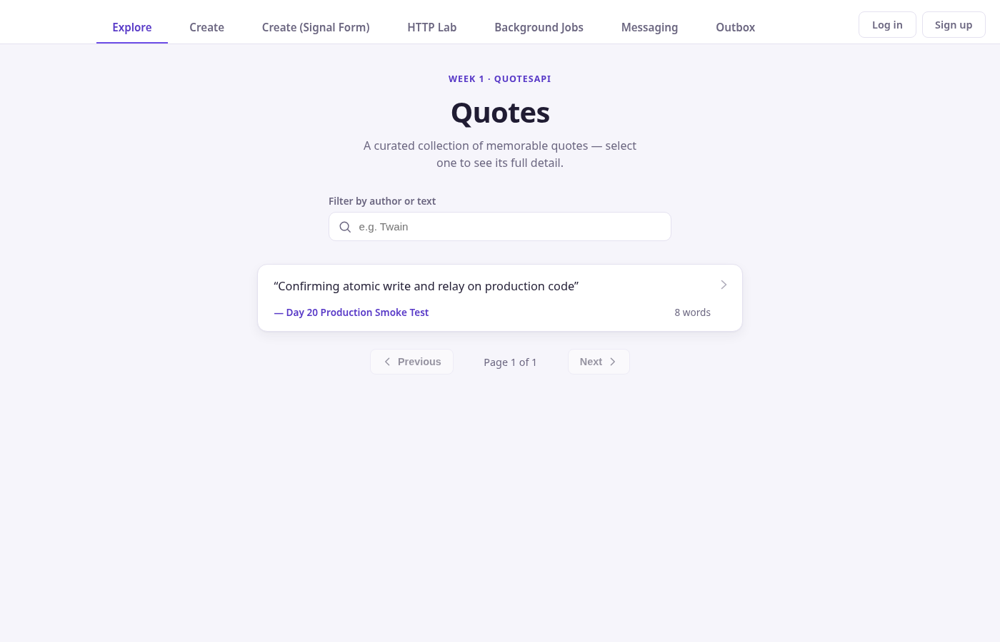
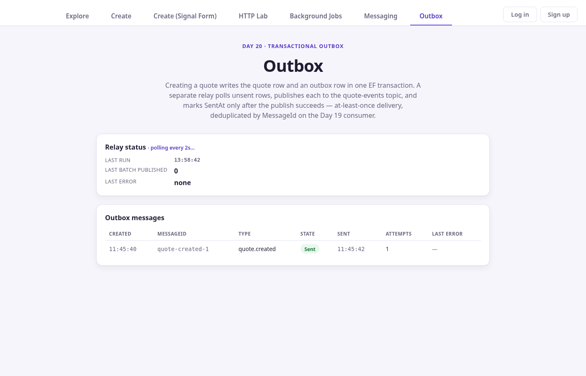

# Day 20 — Transactional Outbox

## Task

"A DB write and a queue publish must not diverge. Implement the transactional outbox: write the domain change + an outbox row in one EF transaction, then a relay publishes and marks sent. Prove no message is lost if the publish step crashes."

## Exercise

"Paste the outbox table + relay. Describe the crash scenario you tested and why no message is lost or duplicated (at-least-once + idempotent consumer)."

## Architecture

Canonical source lives in `day-1/QuotesApi/` (the same project Day 18 and Day 19 built on). This folder holds the Day-20-specific files copied out for reference, plus tests, screenshots, and documentation.

```
POST /api/quotes
      |
      v
BEGIN EF TRANSACTION
      |
      +--> INSERT Quotes
      +--> INSERT OutboxMessages (MessageId = "quote-created-{id}")
      |
COMMIT
      |
      v
HTTP 201 response (no Service Bus dependency on the request path)

OutboxRelayWorker (BackgroundService, polls every 2s)
      |
      v
SELECT unsent OutboxMessages ORDER BY Id
      |
      v
claim (AttemptCount += 1 WHERE SentAt IS NULL)
      |
      v
publish via IQuoteEventPublisher (Day 19's Service Bus publisher)
      |
   success? -----> UPDATE SentAt = now() WHERE SentAt IS NULL
      |
   failure  -----> record LastError, retry next poll
```

The domain write and the outbox row commit or roll back together, in one `AppDbContext` transaction (`QuoteRepository.AddWithOutboxMessageAsync`). The relay is a separate process step: it never runs inside that transaction, and the HTTP request never talks to Service Bus.

## Outbox Table

`OutboxMessage` (`day-1/QuotesApi/Outbox/OutboxMessage.cs`): `Id`, `MessageId` (unique), `MessageType`, `Payload`, `CreatedAt`, `SentAt` (nullable), `AttemptCount`, `LastError`. Migrations exist for both SQLite (`Migrations/`) and SQL Server (`Migrations.SqlServer/`), matching the existing dual-migration convention from `ProcessedMessage`.

## Atomic Transaction

`QuoteRepository.AddWithOutboxMessageAsync` opens one `Database.BeginTransactionAsync`, inserts the `Quote`, inserts the `OutboxMessage` (its `MessageId` is derived from the quote's own generated `Id`, so it's deterministic per domain row), then commits once. Any failure between the two inserts rolls back both.

## Relay

`OutboxRelayWorker` (BackgroundService, same `IServiceScopeFactory` pattern as Day 18's `BackgroundJobWorker`) polls on a `PeriodicTimer` and delegates each batch to the scoped `OutboxRelayProcessor`, which claims a row with a conditional `ExecuteUpdateAsync` (`AttemptCount += 1 WHERE SentAt IS NULL`), publishes, and only then marks `SentAt`. A failed publish leaves `SentAt` null and records `LastError` for the next poll to retry.

## At-Least-Once Delivery

If the process crashes after a successful publish but before the `SentAt` update commits, the row is still unsent on restart and gets published again. This is deliberate: the relay never claims "sent" until the write actually lands, and a lost write here always errs toward re-sending, never toward silent loss.

## Idempotent Consumer

Reused unchanged from Day 19: `QuoteEventProcessor` + the durable `ProcessedMessage` table, keyed on `(SubscriptionName, MessageId)`. The relay always publishes with `idempotencyKey = outboxMessage.MessageId`, so a redelivered outbox row and a genuinely re-delivered Service Bus message collapse onto the same dedupe key.

## Local Verification

10 focused xUnit tests in `Tests.Domain/Outbox/` and `CreateQuoteCommandHandlerTests`, all against a real SQLite `AppDbContext` (no mocking of EF): atomic transaction success, rollback on a real unique-constraint violation, relay publish success, publish failure leaving `SentAt` null with `LastError` recorded and a successful retry, multiple messages processed independently, worker cancellation, worker exception isolation, and the crash-after-publish-before-SentAt scenario feeding the real `QuoteEventProcessor` twice to prove the duplicate is deduplicated. All pass; see `result.md` for the full log.

Also ran the real API locally against the real Azure Service Bus namespace: quote creation, outbox row creation, and the relay's publish call all confirmed working end to end.

## Azure Verification

Reused the existing `thinkschool-rg` resource group, `sb-quotesapi-thinkschool` Service Bus namespace/topic/subscriptions, and `quotes-api` Container App. The Day-20 code (atomic transaction, relay, outbox endpoints) was built and deployed to the real Container App, and the atomic write + relay publish-then-mark-sent were confirmed working there.

An attempt was made to fix production's durable-storage gap (it still runs on ephemeral `/tmp/quotes.db`) by mounting a new Azure Files share at `/data`. This was rolled back: Azure Files over SMB does not support the file locking SQLite's own migration-lock mechanism depends on, and the container crash-looped with `SQLite Error 5: 'database is locked'`. Production was restored to its working `/tmp` configuration. See `result.md` for the full log and the recommended fix (SQL Server via the already-scaffolded `Migrations.SqlServer` path).

## Crash Scenario

See `result.md` → "Crash Scenario". Summary: an outbox row is published (the real/fake publisher records the send), but the row is intentionally left unmarked to model the process dying before the `SentAt` write commits. Restarting the relay against the same durable store picks the still-unsent row back up and republishes it with the same `MessageId`. Feeding both deliveries through the real `QuoteEventProcessor` proves the second one is recognized as a duplicate and produces no second business effect.

## Rollback Scenario

See `result.md` → "Rollback Scenario". A pre-seeded `OutboxMessage` with the `MessageId` a new quote would generate forces a real unique-constraint violation on the second insert inside the transaction; the quote insert is rolled back along with it, so neither row exists afterward.

## UI

A new "Outbox" tab was added to the existing Day-19 Angular app (`Day-16/task-2`), next to Messaging, using the same visual language (page/results/status-badge classes, polling pattern). It shows relay status (last run, last batch size, last error) and the outbox message list (MessageId, type, pending/sent state, created/sent time, attempt count, last error), with loading, empty, and error states backed by the real `/api/outbox` and `/api/outbox/status` endpoints.

## Screenshots

Captured against the live, redeployed Static Web App
(`https://polite-mushroom-04dd5ce00.7.azurestaticapps.net`) with a single
headless Chrome session, after confirming the deployed build actually
contained the Outbox route (see `result.md` → "UI Redeployment").



The Outbox tab sits next to Messaging in the existing nav, right where the
Day-19 Service Bus tab lives.


Relay status (last run, last batch published, last error) and the outbox
message table, both loaded from the real deployed backend
(`GET /api/outbox/status`, `GET /api/outbox`) — not mock data.



The one real outbox row currently in production (`quote-created-1`) already
transitioned to `Sent` before this screenshot was taken, so a genuine
`Pending` row was not available to capture without writing new data to
production — see `result.md` for why that screenshot was intentionally
skipped rather than staged.

## Bug Found and Fixed

Two real bugs surfaced during testing, not simulated:
1. `OrderBy(message => message.CreatedAt)` (a `DateTimeOffset` column) is not translatable by EF Core's SQLite provider for `ORDER BY` — it threw `NotSupportedException` at runtime in both the relay's batch query and the `GET /api/outbox` endpoint. Fixed by ordering on `Id` instead, which is monotonic with creation order on both SQLite and SQL Server.
2. `OutboxRelayWorker.RunOnceAsync` resolved the scoped `OutboxRelayProcessor` *outside* its try/catch, so a DI/scope failure would propagate out of the worker's loop unhandled instead of being isolated per tick. Fixed by moving scope creation and resolution inside the try block.

## What Would Break This

- Writing the outbox row in a separate transaction from the domain change reopens the exact gap this pattern closes.
- A random (non-deterministic) `MessageId` per attempt would defeat the consumer's dedupe key and turn "redelivered" into "processed twice."
- Keeping the outbox table on ephemeral storage (the original `/tmp/quotes.db`) means a container replacement silently loses unsent rows — the failure this whole exercise is meant to prevent.
- A claiming strategy that doesn't use an atomic conditional update (e.g. read-then-write in two steps) lets two relay instances both believe they own a row and double-publish before either marks it sent — still safe here only because the consumer is idempotent, not because the claim is exclusive.
- Changing the consumer's dedupe key away from `MessageId`, or making `ProcessedMessages` non-durable (e.g. an in-memory set), turns every redelivery into a real duplicate business effect.
- Changing the Service Bus topic/subscription names or filters without updating `ServiceBusOptions` silently stops delivery with no error on the publish side.
