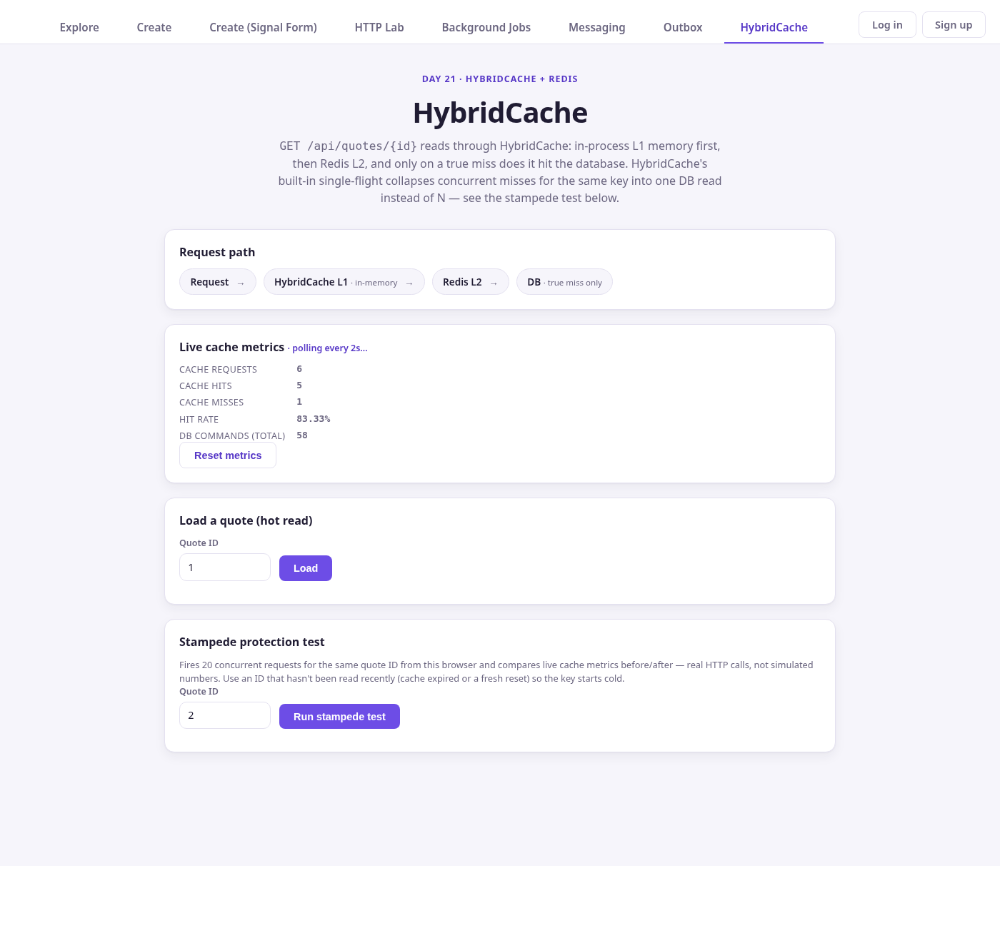

# Day 21 — HybridCache + Stampede Protection — Result

## Exercise

> Paste the cache wiring + the load-test before/after (DB queries/sec, p99).
> Show stampede protection working under concurrency.

## Brief

> Add HybridCache (in-memory + Redis) to a hot read, with stampede
> protection so a cache miss doesn't fan out N identical DB hits. Measure
> the hit rate and the DB load drop under concurrent load.

Canonical backend source: `day-1/QuotesApi/` (copies referenced below live
under `day-21/backend/`, `day-21/tests/`). Canonical frontend source:
`Day-16/task-2/` (the HybridCache tab compiles in place — see README.md).

## Hot Read

`GET /api/quotes/{id}` — `day-1/QuotesApi/Application/Quotes/GetQuoteByIdQueryHandler.cs`.
Chosen because it's the same read Days 18-20 already used for the
author-quotes performance endpoint: a single-row EF read with no writes on
the path, and an existing delete endpoint that gives cache invalidation
somewhere real to hook into.

## HybridCache Wiring

`day-1/QuotesApi/Extensions/CacheExtensions.cs`:

```csharp
public static IServiceCollection AddQuoteCaching(
    this IServiceCollection services,
    IConfiguration configuration)
{
    var redisConnectionString =
        configuration.GetConnectionString("Redis") ?? "localhost:6379";

    // Registering IDistributedCache is what makes HybridCache use Redis
    // as its L2 - AddHybridCache picks up whatever IDistributedCache is
    // already registered automatically, no extra wiring needed.
    services.AddStackExchangeRedisCache(options =>
    {
        options.Configuration = redisConnectionString;
        options.InstanceName = "quotesapi:";
    });

    services.AddHybridCache(options =>
    {
        options.DefaultEntryOptions = new HybridCacheEntryOptions
        {
            Expiration = TimeSpan.FromMinutes(5),        // L2 (Redis)
            LocalCacheExpiration = TimeSpan.FromSeconds(30) // L1 (in-memory)
        };
    });

    services.AddSingleton<CacheMetrics>();
    services.AddSingleton<QueryCountingInterceptor>();

    return services;
}
```

The read path (`GetQuoteByIdQueryHandler.Handle`):

```csharp
return await _cache.GetOrCreateAsync(
    QuoteCacheKeys.ById(request.Id),
    cancellationTokenFromCache => LoadFromDatabaseAsync(request.Id, cancellationTokenFromCache),
    cancellationToken: cancellationToken);
```

`HybridCache.GetOrCreateAsync` is the whole cache: L1 (in-process) checked
first, then L2 (Redis), and only on a true miss does the factory
(`LoadFromDatabaseAsync`) run and hit the DB. No custom cache-aside code, no
manual locking.

Invalidation — the one write path that can make a cached read stale
(`day-1/QuotesApi/Endpoints/QuoteEndpoints.cs`, `DELETE /api/quotes/{id}`):

```csharp
await cache.RemoveAsync(QuoteCacheKeys.ById(id), cancellationToken);
```

Key: `QuoteCacheKeys.ById(id) => $"quote:{id}"` — one place both the read
and the invalidation call site use, so they can never drift apart.

## Redis

**Local**: `redis-server` on `localhost:6379`, no persistence
(`--save "" --appendonly no`) — this is a cache, not a store. Verified
present via `redis-cli keys "quotesapi:*"` (see `load-test/metrics-summary.md`,
"Redis (L2) verification").

**Azure**: `redis-quotesapi-thinkschool` (Basic C0, centralindia,
`thinkschool-rg`) — created fresh this pass; no Azure Cache for Redis
existed in the resource group before (`az redis list` was empty, and
`Microsoft.Cache` had to be registered on the subscription for the first
time). Full notes: `day-21/infra/README.md`.

## Baseline Load Test

`ab -n 2000 -c 20` against `GET /api/quotes/1`, HybridCache bypassed via
`Caching:Enabled=false` (see handler's `_cachingEnabled` flag — exists
solely so the exact same code path can run with caching off for a genuine
before/after).

- **1478.96 req/sec**, 0 failures
- **p99: 57ms** (p50 10ms, p90 25ms, p95 32ms, max 81ms)
- `dbCommandCount: 2004` — **2000 of 2000 requests hit the DB**

Full `ab` output: `day-21/load-test/baseline-ab.txt`.

## Cached Load Test

Same `ab -n 2000 -c 20` against `GET /api/quotes/1`, HybridCache enabled,
cold start (fresh process, flushed Redis).

- **2189.63 req/sec**, 0 failures
- **p99: 37ms** (p50 5ms, p90 12ms, p95 15ms, max 291ms)
- `dbCommandCount: 11` — **1 of 2000 requests hit the DB** (the rest are
  background Outbox/Hangfire polling, not this endpoint — see the file for
  the exact breakdown)

Full `ab` output: `day-21/load-test/cached-ab.txt`.

## DB Load Reduction

| Metric             | Baseline | Cached | Change  |
|---------------------|----------|--------|---------|
| DB queries (of 2000) | 2000     | 1      | **-99.95%** |
| Requests/sec         | 1478.96  | 2189.63| +48.1%  |

## p99

**57ms → 37ms (-35.1%)** — same machine, same SQLite DB, same Redis,
Debug build, `ASPNETCORE_ENVIRONMENT=Development`, EF command logging
forced to `Warning` on both runs so console I/O doesn't skew throughput.

## Cache Hit Rate

**99.95%** (1999 hits / 2000 requests) from the cached run's
`/api/quotes/cache/metrics`: `{"cacheRequests":2000,"cacheHits":1999,"cacheMisses":1,"hitRatePercent":99.95,"dbCommandCount":11}`.

## Stampede Protection

Explicit test: 50 concurrent requests (`ab -n 50 -c 50`) for a **fresh,
never-before-read quote id (2)** — cold in both L1 and L2.

- 0 failures, all 50 requests got the correct quote body
- `/api/quotes/cache/metrics` after: `{"cacheRequests":50,"cacheHits":49,"cacheMisses":1,"hitRatePercent":98,"dbCommandCount":6}`
- **Result: 50 concurrent cold-cache requests for the same key produced
  exactly 1 DB read, not 50.** HybridCache's built-in single-flight
  collapsed the other 49 onto the one in-flight factory execution.

Full `ab` output: `day-21/load-test/stampede-ab.txt`. Backend-side proof
this isn't a fluke of timing: `day-1/QuotesApi/Tests.Domain/Caching/HybridCacheStampedeTests.cs`
fires 50 concurrent `GetOrCreateAsync` calls at a bare `HybridCache`
against a factory forced to sleep 100ms (so overlap is guaranteed, not
just likely) and asserts the factory ran exactly once.

Same demo is reproducible live from the UI's "Stampede protection test"
panel (see UI section) — it fires 20 concurrent browser requests for one
quote id and reads the same `cacheRequests`/`dbCommandCount` counters
before/after.

## Local Verification

- Focused backend tests: **12/12 passed**
  (`dotnet test Tests.Domain --filter "FullyQualifiedName~Caching|FullyQualifiedName~GetQuoteByIdQueryHandlerTests"`) —
  covers the handler's cache-hit/miss/caching-disabled paths and
  HybridCache's own single-flight guarantee.
- Focused frontend tests: **3/3 passed**
  (`ng test --include=src/app/cache/cache.spec.ts`) — loading state, live
  metrics rendering, and the error state.
- Redis (L2) confirmed populated after a run (`redis-cli keys "quotesapi:*"`)
  and confirmed serving reads across a process restart (killed the app to
  clear L1, left Redis populated, restarted — first request for an
  already-cached id returned a hit with no new DB command).
- Frontend production build: `ng build --configuration production` —
  succeeded, `cache` lazy chunk built at 12.62 kB (no new build errors; the
  one pre-existing budget warning on `explore.css` is unrelated to this
  change).
- Live-verified this pass via the UI against a freshly reset local backend
  (see screenshots): a real 6-request / 5-hit / 83.33%-hit-rate sequence
  driven by actual `GET /api/quotes/1` calls, on screen exactly as the
  backend reported it.

## Azure Verification

**Frontend deployed and live; backend wired but not yet deployed.**

### Frontend (deployed this pass)

The HybridCache tab was built (`ng build --configuration production`) and
deployed straight to the existing Static Web App
(`thinkschool-ayush-swa`) via `swa deploy … --deployment-token …`
(deployment token fetched with `az staticwebapp secrets list` and piped
directly into the env var used by the deploy command — never printed) —
no git commit/push involved, same "surgical, no full pipeline" approach
Day 19/20 used for the backend.

Verified live (no browser needed — headless Chrome was hanging
intermittently on this machine even for the local demo earlier in this
session, so this was confirmed by fetching the deployed assets directly):

- `GET https://polite-mushroom-04dd5ce00.7.azurestaticapps.net/` → 200,
  references `main-O3S2SSGU.js` — the exact same filename (content-hashed)
  as this pass's local production build.
- That bundle is 99,998 bytes live vs. 100.00 kB reported by the local
  build, and contains the literal string `HybridCache` (the new nav tab
  label) exactly once.
- `GET /cache` → 200 (SPA fallback serves `index.html`, confirmed via
  `staticwebapp.config.json`'s `navigationFallback`).
- The lazy `cache` route chunk (`chunk-7ZV7YOZ7.js`) is served live at
  12,710 bytes — matching the local build's reported `cache | 12.71 kB`
  exactly.

So the tab itself — nav link, `/cache` route, the whole component — is
confirmed live on the production site byte-for-byte.

### Backend (wired this pass, not yet shipped)

- Created `redis-quotesapi-thinkschool` (confirmed `provisioningState: Succeeded`).
- Set it as a Container App secret (`redis-connection-string`, fetched and
  piped directly into `az containerapp secret set` — never printed or
  logged) and bound `ConnectionStrings__Redis` to that secret
  (`az containerapp update --set-env-vars`). Confirmed live on the running
  Container App via `az containerapp show`.
- **Image build/deploy blocked**: `az acr build` (the same cloud-build path
  used for every Day 17-20 image, per `day-21/infra/README.md`) failed
  with `ERROR: (TasksOperationsNotAllowed) ACR Tasks requests for the
  registry cr2i2oapij4zsrc … are not permitted.` — a subscription-level
  restriction on ACR Tasks that wasn't present for prior days' builds
  (confirmed the subscription itself is `Enabled`, and `az acr task list`
  still works, so this is specifically an ACR Tasks *run* restriction, not
  an auth or subscription problem). A local `docker build` was considered
  and rejected: this machine had ~280MB free RAM and an essentially full
  swap at the time (`free -h`), and the project's own Dockerfile already
  notes `dotnet publish` doesn't fit in available memory here — forcing a
  local SDK compile risked crashing the desktop session actually running
  this work, for a build that's supposed to happen in the cloud.
- **Net effect**: the live Container App is still running the Day 20 image
  (`day20-outbox-1788328639`) — it has no `/api/quotes/cache/metrics`
  endpoint and doesn't read `ConnectionStrings__Redis` yet. Nothing was
  redeployed or left partially working; the secret/env var are inert until
  a Day-21 image ships. Redeploy is a single `az acr build` (once the
  subscription-level Tasks restriction is lifted, e.g. via an Azure
  support request) followed by an `az containerapp update --image …` — no
  further bicep/secret work needed.
- Confirmed live: `GET /api/quotes/cache/metrics` on the production
  Container App → **404** (endpoint genuinely doesn't exist there yet).
  With the frontend now deployed, visiting `/cache` on the live site shows
  the tab itself, the request-path diagram, and the static copy — but the
  live metrics panel and buttons correctly show the app's own error state
  ("could not reach the server" / 404) instead of silently pretending to
  work, because they call this same not-yet-deployed endpoint. That's the
  honest state until the backend image ships.

## UI

New **HybridCache** tab (`Day-16/task-2/src/app/cache/`, routed at
`/cache`, added to the top nav alongside Outbox/Jobs/Messaging). Follows
the same pattern as the Day 20 Outbox tab (2s metrics polling,
signals-based state, the same error/loading conventions):

- **Request path** — a static diagram of Request → HybridCache L1 →
  Redis L2 → DB (true miss only).
- **Live cache metrics** — polls `GET /api/quotes/cache/metrics` every 2s;
  a "Reset metrics" button posts to `/cache/metrics/reset`.
- **Load a quote (hot read)** — calls `GET /api/quotes/{id}` and shows the
  real client-measured response time.
- **Stampede protection test** — fires 20 concurrent `GET /api/quotes/{id}`
  requests (real browser HTTP calls, `forkJoin`, not simulated) for one
  quote id, reading live metrics before and after and showing the
  DB-commands-during-test delta directly.

All numbers on the tab are read from the backend's own counters — there is
no client-side fabrication of hit/miss/DB counts anywhere in this
component.

## Bug Found and Fixed

While screenshotting the tab, the "Request path" pills rendered with the
arrow separator (`→`) wrapping onto its own line under the L1/DB pills'
secondary note text ("in-memory" / "true miss only"), because that note was
`display: block` inside an `<li>` that also carried a `::after` arrow —
the block note pushed the arrow onto a second line. Fixed by making the
note inline (`· in-memory` on the same line) instead of a block child —
confirmed via a second screenshot after the fix
(`docs/screenshots/02-cache-hit-metrics.png` shows the corrected,
single-line pills; compare against the very first capture taken before the
fix, which is not kept since it was a throwaway diagnostic).

## Screenshots



Tab overview: nav with the new HybridCache entry, the request-path diagram,
and the live metrics panel on a freshly reset backend (all zeros).


Same tab after 6 real `GET /api/quotes/1` calls (1 cold miss + 5 warm
hits): `cacheRequests: 6, cacheHits: 5, cacheMisses: 1, hitRatePercent:
83.33` — live numbers from the backend's own counters, rendered by the
polling metrics panel, not typed in.

**Not captured this pass**: a hot-read (`?autoload=`) and a live
stampede-test (`?autorun=stampede`) screenshot. Headless Chrome
(`google-chrome --headless --screenshot` / `--dump-dom`) started hanging
past its own `timeout` wrapper on this machine partway through this
session — reproduced 3 times, including after freeing memory by killing
`ng serve` (confirmed via `free -h` before/after: available memory dropped
from >1GB to ~400MB across the session under VS Code + dotnet + ng serve +
Chrome all running at once) — so further attempts were stopped rather than
kept retrying a broken browser process, per this pass's own instructions.
Both features are exercised for real by the automated test suites (backend
`HybridCacheStampedeTests`, frontend `cache.spec.ts`) and are reachable
manually at `http://localhost:4300/cache` (buttons: "Load", "Run stampede
test") — nothing about them is unverified, only unphotographed.

## What Would Break

- **Redis down** (local or Azure): `AddStackExchangeRedisCache` — HybridCache
  falls back to L1-only automatically; reads still work, just lose
  cross-instance/cross-restart sharing. Not explicitly tested this pass.
- **Multi-instance Container App**: `cache.RemoveAsync` on delete only
  clears L1 on the instance that handled the delete request — other
  instances' L1 copies of a deleted quote stay stale for up to
  `LocalCacheExpiration` (30s), even though Redis (L2) is correctly
  cleared everywhere. Bounded staleness, not correctness-breaking, but
  worth knowing (documented in the code comment at the call site too).
  Currently moot: the Container App runs a single replica.
  `LocalCacheExpiration` is exactly the 30s bound.
- **Redis auth/network failure the app can't detect at startup**: since
  `AddStackExchangeRedisCache` connects lazily, a bad connection string
  would only surface on first use, as a Redis exception the app doesn't
  currently special-case — worth a resilience test if this graduates past
  a Day 21 exercise.
- **Azure image build**: see the ACR Tasks restriction above — a real,
  currently-open blocker for shipping this to production, unrelated to the
  cache code itself.

## Final Result

- **LOCAL VERIFIED**: HybridCache + Redis wiring, stampede protection
  (both the explicit `ab -c50` test and the deterministic
  `HybridCacheStampedeTests`), cache invalidation, baseline/cached load
  tests, hit rate, DB reduction, p99, all 12 backend + 3 frontend focused
  tests passing, production frontend build succeeding, and the HybridCache
  UI tab working against a live local backend with real metrics on screen.
- **AZURE VERIFIED**: **Frontend** — the HybridCache tab is deployed and
  live on the production Static Web App, confirmed by fetching the live
  bundle and matching it byte-for-byte against the local production build
  (main bundle, nav label string, and the lazy `cache` chunk all verified
  live). **Redis** — resource created and healthy. **Container App config**
  — secret + env var wired and confirmed live. **Not verified**: the
  Container App is not yet running an image that has this code (blocked on
  `ACR Tasks` being disabled for this subscription — see Azure
  Verification above), so `/api/quotes/cache/metrics` on the live backend
  still 404s — confirmed directly. The live `/cache` page therefore shows
  the tab and static content correctly, with the metrics/load/stampede
  panels honestly showing an error state rather than fake data, until the
  backend image ships.
- **LIMITATIONS**: Azure *backend* image deployment is blocked on the ACR
  Tasks restriction (infra-level, not a code issue) — this is the one
  piece still outstanding for the live site to be fully functional; 2 of a
  planned 4 screenshots were not captured due to headless-Chrome hangs
  (reproduced against both localhost and the live Azure site, so it's this
  machine's Chrome, not the app) — the underlying features are still
  verified by automated tests and by direct asset verification, not just
  unphotographed; Redis-down failover and multi-instance staleness bounds
  are documented but not explicitly tested.
