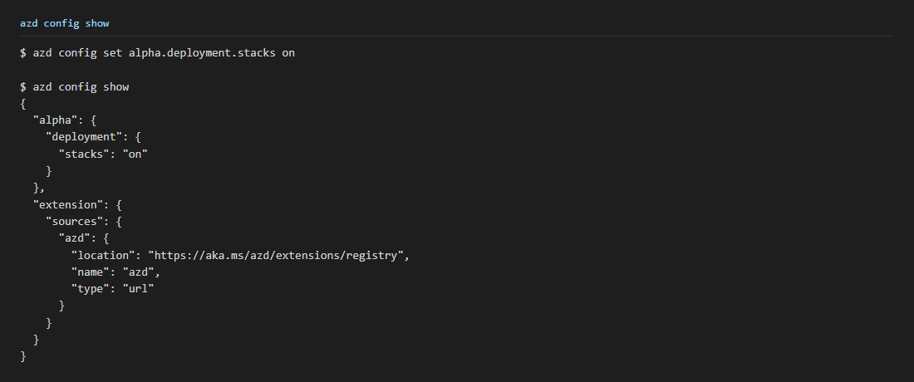
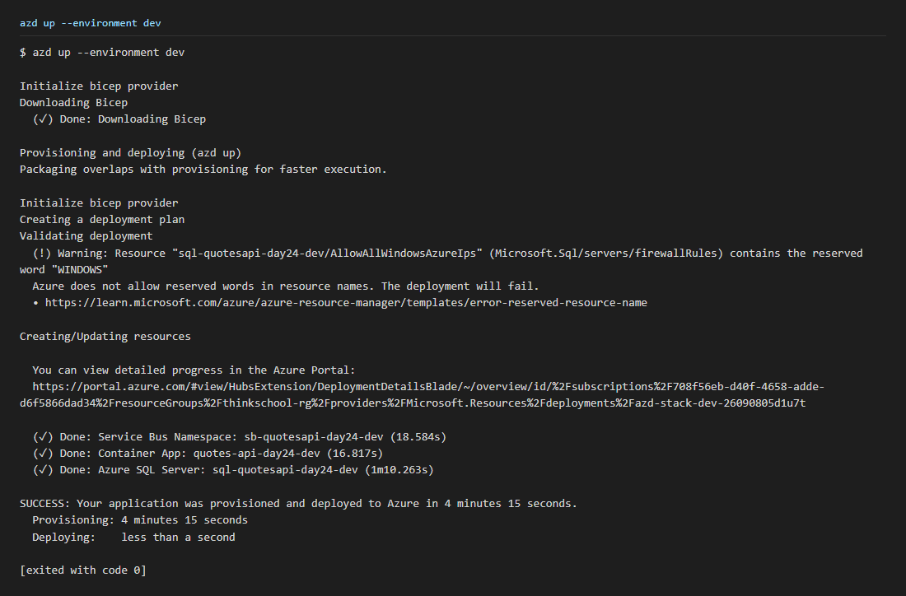
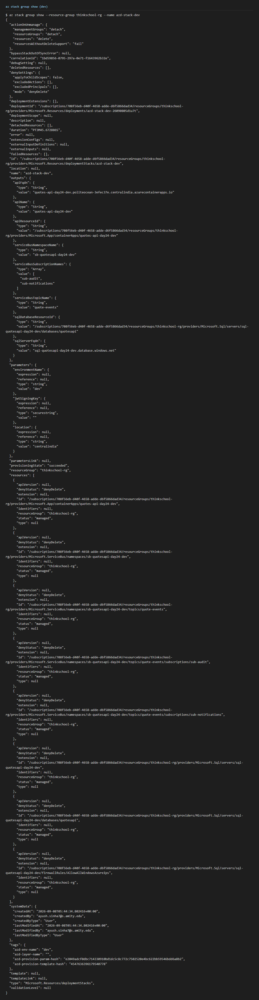
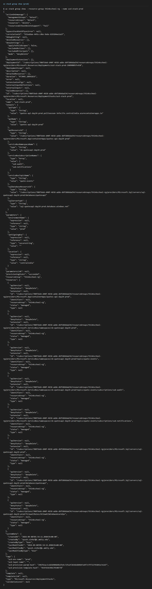
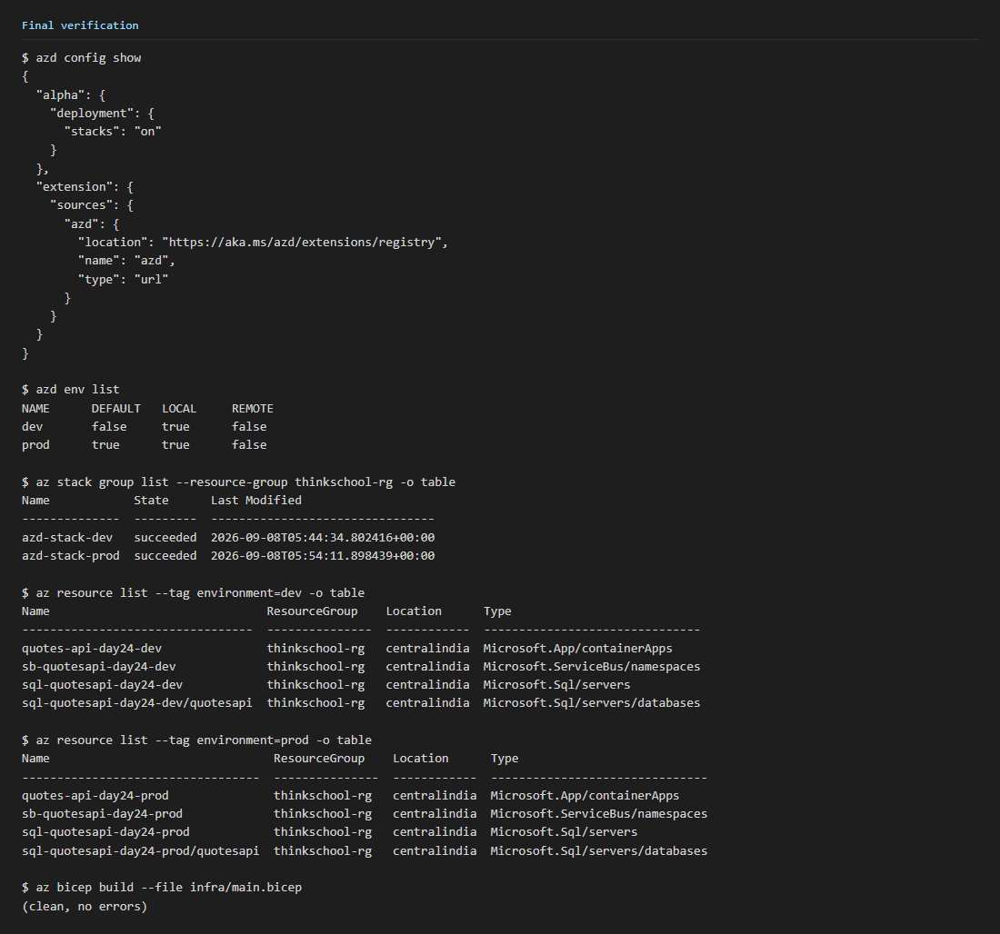

# Day 24 — Deployment Stacks + azd

## Exercise Answer

**azd configuration**

```
$ azd config set alpha.deployment.stacks on

$ azd config show
{
  "alpha": {
    "deployment": {
      "stacks": "on"
    }
  },
  "extension": {
    "sources": {
      "azd": {
        "location": "https://aka.ms/azd/extensions/registry",
        "name": "azd",
        "type": "url"
      }
    }
  }
}
```

**Dev deployment output**

```
$ azd up --environment dev
...
  (✓) Done: Service Bus Namespace: sb-quotesapi-day24-dev (18.584s)
  (✓) Done: Container App: quotes-api-day24-dev (16.817s)
  (✓) Done: Azure SQL Server: sql-quotesapi-day24-dev (1m10.263s)

SUCCESS: Your application was provisioned and deployed to Azure in 4 minutes 15 seconds.
```

**Prod deployment output**

```
$ azd up --environment prod
...
  (✓) Done: Service Bus Namespace: sb-quotesapi-day24-prod (18.727s)
  (✓) Done: Container App: quotes-api-day24-prod (17.013s)
  (✓) Done: Azure SQL Server: sql-quotesapi-day24-prod (1m12.014s)

SUCCESS: Your application was provisioned and deployed to Azure in 4 minutes 14 seconds.
```

**What Deployment Stacks give you over plain deployments:** a stack tracks the full set of resources it manages as one unit, applies `denyDelete` protection to all of them, and reports drift against the live state on every re-run — a plain `az deployment group create`/`what-if` does none of this.

## azd Configuration

```
$ azd config set alpha.deployment.stacks on

$ azd config show
{
  "alpha": {
    "deployment": {
      "stacks": "on"
    }
  },
  "extension": {
    "sources": {
      "azd": {
        "location": "https://aka.ms/azd/extensions/registry",
        "name": "azd",
        "type": "url"
      }
    }
  }
}
```



## Dev Deployment

```
$ azd up --environment dev

Initialize bicep provider
Downloading Bicep
  (✓) Done: Downloading Bicep

Provisioning and deploying (azd up)
Packaging overlaps with provisioning for faster execution.

Initialize bicep provider
Creating a deployment plan
Validating deployment
  (!) Warning: Resource "sql-quotesapi-day24-dev/AllowAllWindowsAzureIps" (Microsoft.Sql/servers/firewallRules) contains the reserved word "WINDOWS"
  Azure does not allow reserved words in resource names. The deployment will fail.
  • https://learn.microsoft.com/azure/azure-resource-manager/templates/error-reserved-resource-name

Creating/Updating resources

  (✓) Done: Service Bus Namespace: sb-quotesapi-day24-dev (18.584s)
  (✓) Done: Container App: quotes-api-day24-dev (16.817s)
  (✓) Done: Azure SQL Server: sql-quotesapi-day24-dev (1m10.263s)

SUCCESS: Your application was provisioned and deployed to Azure in 4 minutes 15 seconds.
  Provisioning: 4 minutes 15 seconds
  Deploying:    less than a second
```

The "reserved word WINDOWS" warning is a false positive against the firewall rule name `AllowAllWindowsAzureIps` (the same name Azure itself uses for this rule); the deployment completed successfully regardless.



## Dev Deployment Stack

```
$ az stack group list --resource-group thinkschool-rg -o table
Name           State      Last Modified
-------------  ---------  --------------------------------
azd-stack-dev  succeeded  2026-09-08T05:44:34.802416+00:00

$ az stack group show --resource-group thinkschool-rg --name azd-stack-dev
{
  "denySettings": { "mode": "denyDelete", ... },
  "provisioningState": "succeeded",
  "resources": [ 8 managed resources, each "denyStatus": "denyDelete" ],
  ...
}
```

All 8 resources (Container App, Service Bus namespace + topic + 2 subscriptions, SQL server + database + firewall rule) are tracked as `managed` under `azd-stack-dev` with `denyDelete` protection active.



## Prod Deployment

```
$ azd up --environment prod

Initialize bicep provider

Provisioning and deploying (azd up)
Packaging overlaps with provisioning for faster execution.

Initialize bicep provider
Creating a deployment plan
Validating deployment
  (!) Warning: Resource "sql-quotesapi-day24-prod/AllowAllWindowsAzureIps" (Microsoft.Sql/servers/firewallRules) contains the reserved word "WINDOWS"
  Azure does not allow reserved words in resource names. The deployment will fail.
  • https://learn.microsoft.com/azure/azure-resource-manager/templates/error-reserved-resource-name

Creating/Updating resources

  (✓) Done: Service Bus Namespace: sb-quotesapi-day24-prod (18.727s)
  (✓) Done: Container App: quotes-api-day24-prod (17.013s)
  (✓) Done: Azure SQL Server: sql-quotesapi-day24-prod (1m12.014s)

SUCCESS: Your application was provisioned and deployed to Azure in 4 minutes 14 seconds.
  Provisioning: 4 minutes 14 seconds
```


## Prod Deployment Stack

```
$ az stack group list --resource-group thinkschool-rg -o table
Name            State      Last Modified
--------------  ---------  --------------------------------
azd-stack-dev   succeeded  2026-09-08T05:44:34.802416+00:00
azd-stack-prod  succeeded  2026-09-08T05:54:11.898439+00:00
```

`azd-stack-prod` tracks its own 8 resources (`quotes-api-day24-prod`, `sb-quotesapi-day24-prod` + topic + 2 subscriptions, `sql-quotesapi-day24-prod` + database + firewall rule), independently of `azd-stack-dev`, each with `denyDelete` protection.



## Deployment Stack Benefit

A Deployment Stack tracks its managed resources as one auditable unit and denies out-of-band deletion of any of them (`denyDelete`), while a plain `az deployment group create` leaves every resource independently deletable with no record of which resources belong together.

## Final Verification

```
$ azd config show
{ "alpha": { "deployment": { "stacks": "on" } }, ... }

$ azd env list
NAME      DEFAULT   LOCAL     REMOTE
dev       false     true      false
prod      true      true      false

$ az stack group list --resource-group thinkschool-rg -o table
Name            State      Last Modified
--------------  ---------  --------------------------------
azd-stack-dev   succeeded  2026-09-08T05:44:34.802416+00:00
azd-stack-prod  succeeded  2026-09-08T05:54:11.898439+00:00

$ az resource list --tag environment=dev -o table
quotes-api-day24-dev               Microsoft.App/containerApps
sb-quotesapi-day24-dev             Microsoft.ServiceBus/namespaces
sql-quotesapi-day24-dev            Microsoft.Sql/servers
sql-quotesapi-day24-dev/quotesapi  Microsoft.Sql/servers/databases

$ az resource list --tag environment=prod -o table
quotes-api-day24-prod               Microsoft.App/containerApps
sb-quotesapi-day24-prod             Microsoft.ServiceBus/namespaces
sql-quotesapi-day24-prod            Microsoft.Sql/servers
sql-quotesapi-day24-prod/quotesapi  Microsoft.Sql/servers/databases

$ az bicep build --file infra/main.bicep
(clean, no errors)
```


