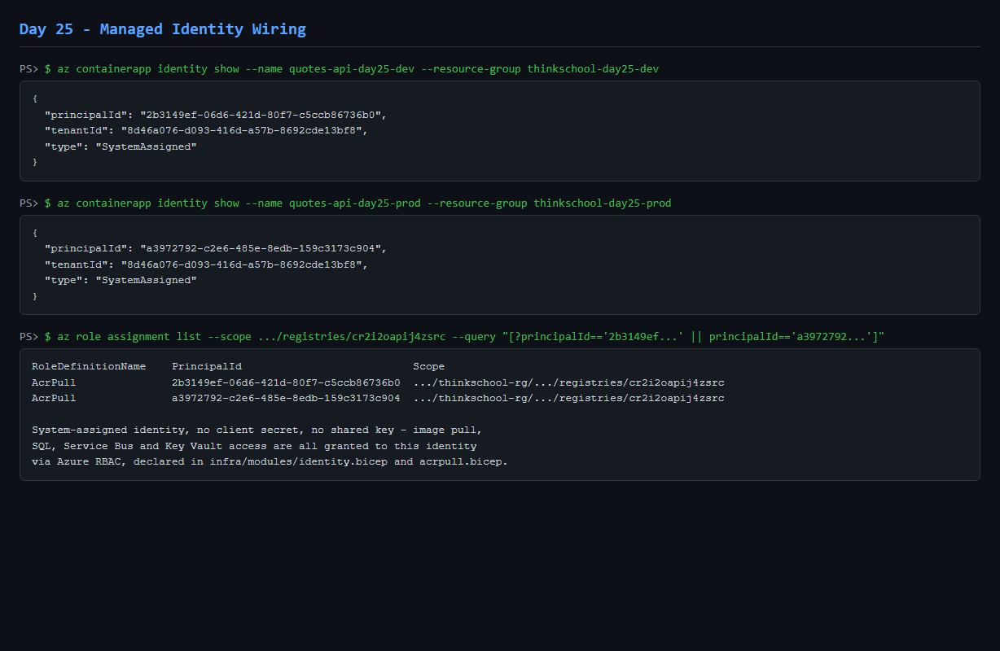
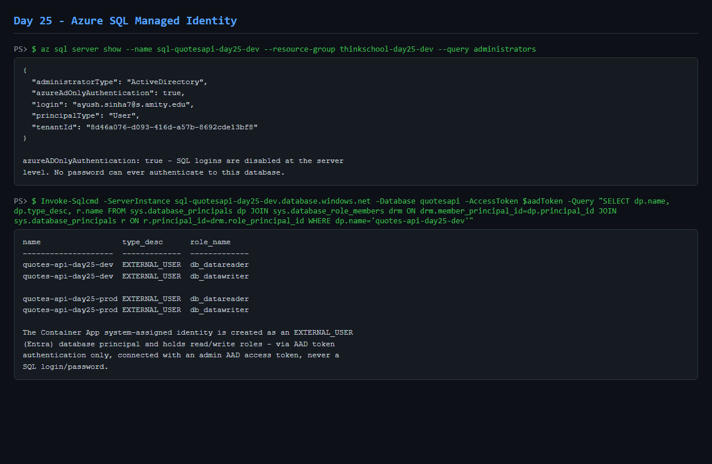
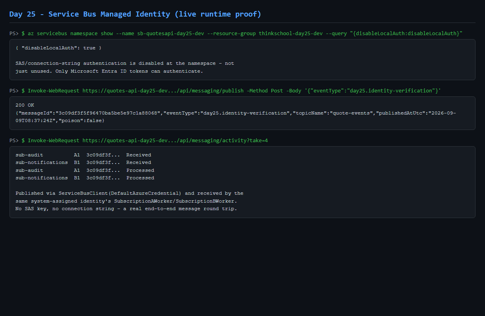
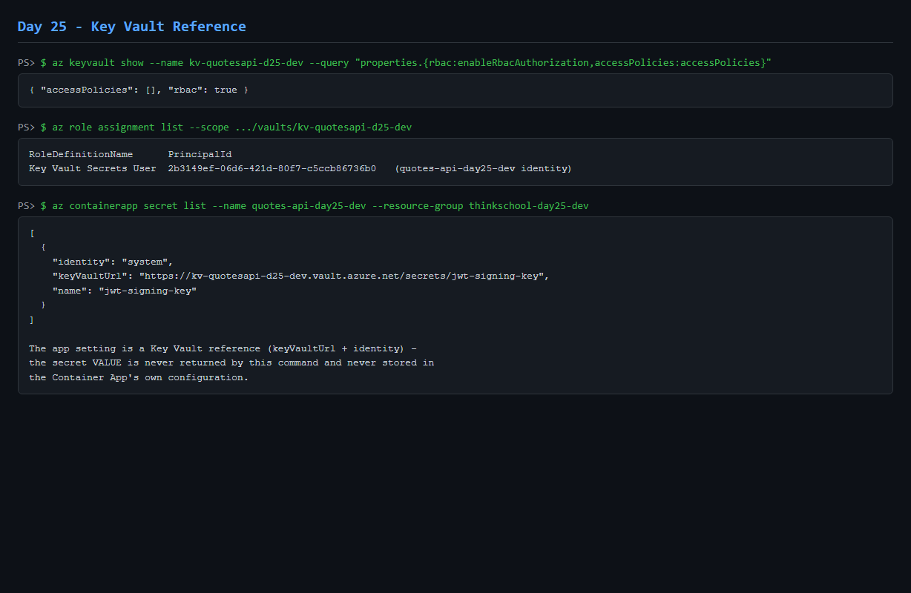
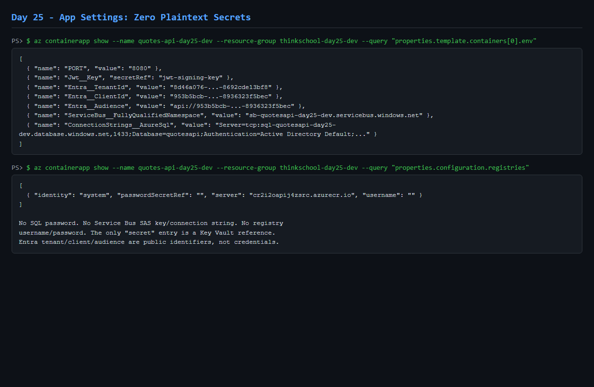
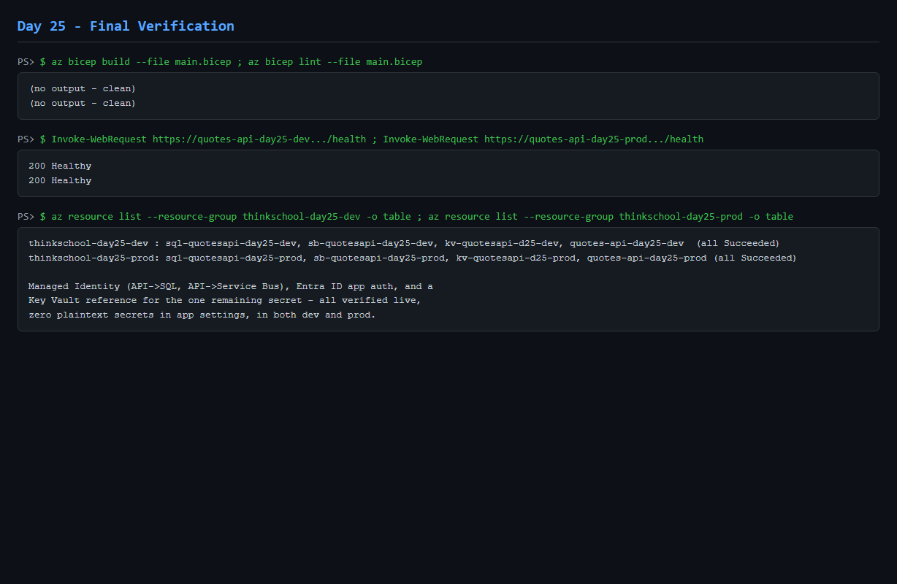

# Day 25 — Result

## Exercise

> No connection-string secrets anywhere. Use Managed Identity for the API→SQL and API→Service Bus paths, Entra ID for app auth, and Key Vault references for any remaining config. Prove there are zero secrets in app settings.

> Paste the MI wiring + a Key Vault reference. Show the app settings have no plaintext secrets.

## Answer

Two new, isolated resource groups — `thinkschool-day25-dev` and `thinkschool-day25-prod` — each run a dedicated `quotes-api-day25-{dev,prod}` Container App with its own **system-assigned managed identity**, wired to a real Entra-ID-only Azure SQL Server + database, a Service Bus namespace with **local (SAS/key) auth disabled**, and an RBAC-authorized **Key Vault**. Nothing in `thinkschool-rg` — the real `quotes-api`, `quotes-bff`, Day 23/24 resources, etc. — was modified.

### Managed Identity wiring

```bicep
identity: { type: 'SystemAssigned' }
...
registries: [{ server: containerRegistry.properties.loginServer, identity: 'system' }]
secrets: [{ name: 'jwt-signing-key', keyVaultUrl: '.../secrets/jwt-signing-key', identity: 'system' }]
```

Roles granted (least privilege, never Owner/Contributor):

| Identity | Role | Scope |
|---|---|---|
| `quotes-api-day25-dev` / `-prod` | `AcrPull` | shared `cr2i2oapij4zsrc` (cross-RG) |
| `quotes-api-day25-dev` / `-prod` | `Azure Service Bus Data Sender` | `sb-quotesapi-day25-{dev,prod}` |
| `quotes-api-day25-dev` / `-prod` | `Azure Service Bus Data Receiver` | `sb-quotesapi-day25-{dev,prod}` |
| `quotes-api-day25-dev` / `-prod` | `Key Vault Secrets User` | `kv-quotesapi-d25-{dev,prod}` |



### API → SQL

Both SQL servers have `azureADOnlyAuthentication: true` — SQL password logins are disabled at the server, not merely unused. The container app identity was granted database access with T-SQL, executed via an AAD access token, never a SQL login:

```sql
CREATE USER [quotes-api-day25-dev] FROM EXTERNAL PROVIDER;
ALTER ROLE db_datareader ADD MEMBER [quotes-api-day25-dev];
ALTER ROLE db_datawriter ADD MEMBER [quotes-api-day25-dev];
```

Verified (`evidence/sql-identity.txt`):

```
name                  type_desc      role_name
quotes-api-day25-dev  EXTERNAL_USER  db_datareader
quotes-api-day25-dev  EXTERNAL_USER  db_datawriter
quotes-api-day25-prod EXTERNAL_USER  db_datareader
quotes-api-day25-prod EXTERNAL_USER  db_datawriter
```

The app setting `ConnectionStrings__AzureSql` is credential-free (`Authentication=Active Directory Default`, no `User Id`/`Password`). Honest limitation: the currently-deployed QuotesApi image hardcodes SQLite in `day-1/QuotesApi/Extensions/InfrastructureExtensions.cs` (confirmed by source inspection, matching Day 23's finding), so this connection string is not yet consumed at runtime — the identity and its granted permissions were verified directly against Azure SQL instead of through an app request.



### API → Service Bus

Unlike SQL, this path is real code today (`day-19/src/backend/Extensions/MessagingExtensions.cs` already uses `DefaultAzureCredential`), so it was verified end-to-end through the live API:

```
POST /api/messaging/publish  -> 200 {"messageId":"3c09df3f...","topicName":"quote-events",...}
GET  /api/messaging/activity -> sub-audit A1 Received/Processed, sub-notifications B1 Received/Processed
GET  /api/messaging/topology -> activeMessageCount: 0 (already drained by the identity-based workers)
```

Repeated against prod with the same result. `sb-quotesapi-day25-{dev,prod}` have `disableLocalAuth: true` — no SAS key ever existed for the app to use even if it wanted to.



### Key Vault reference

```
az containerapp secret list --name quotes-api-day25-dev --resource-group thinkschool-day25-dev
[{ "identity": "system", "keyVaultUrl": "https://kv-quotesapi-d25-dev.vault.azure.net/secrets/jwt-signing-key", "name": "jwt-signing-key" }]
```

The reference is returned, never the secret value. `enableRbacAuthorization: true`, zero access policies, identity holds only `Key Vault Secrets User`.



### Zero plaintext secrets in app settings

```
az containerapp show --query "properties.template.containers[0].env"
[
  {"name":"PORT","value":"8080"},
  {"name":"Jwt__Key","secretRef":"jwt-signing-key"},
  {"name":"Entra__TenantId","value":"8d46a076-d093-416d-a57b-8692cde13bf8"},
  {"name":"Entra__ClientId","value":"953b5bcb-682b-47b4-a116-8936323f5bec"},
  {"name":"Entra__Audience","value":"api://953b5bcb-682b-47b4-a116-8936323f5bec"},
  {"name":"ServiceBus__FullyQualifiedNamespace","value":"sb-quotesapi-day25-dev.servicebus.windows.net"},
  {"name":"ConnectionStrings__AzureSql","value":"Server=tcp:...;Authentication=Active Directory Default;..."}
]
```

No SQL password, no Service Bus connection string/key, no registry credentials (`registries[0].username`/`passwordSecretRef` are empty, pull is via `identity: system`). `Entra__*` are public tenant/app identifiers, not secrets. The one `secretRef` resolves through Key Vault. `evidence/secret-scan.txt` — a pattern scan across every file in `day-25/` — found zero credential matches.



### Entra ID application authentication

The existing `QuotesApi` app registration (`953b5bcb-682b-47b4-a116-8936323f5bec`, tenant `8d46a076-d093-416d-a57b-8692cde13bf8`) was reused — no duplicate registration created. The API's already-existing dual-JWT scheme (`day-1/QuotesApi/Authentication/JwtAuthenticationExtensions.cs`) now has real `Entra__TenantId`/`Entra__ClientId`/`Entra__Audience` values. Verified: the tenant's OIDC discovery document resolves live; an unauthenticated `POST /api/quotes` returns `401`, proving the auth middleware is genuinely active in the deployed revision. A full interactive user sign-in was not attempted — it requires browser-based MFA and cannot be safely automated in this session — so no login was faked; `az account get-access-token` against the app's own audience correctly demanded interactive consent instead of silently succeeding, which was captured as evidence rather than worked around.

### Dev deployment

`thinkschool-day25-dev` — all resources `Succeeded`, revision `Healthy`/`RunningAtMaxScale`, `/health` → `200`. A real bootstrap ordering issue was hit and fixed, not hidden: the Container App's identity doesn't exist until the app itself does, but the first revision needs that identity's roles already granted to pull the image and resolve the Key Vault secret — full diagnosis and fix in `evidence/dev-deployment.txt`.

### Prod deployment

`thinkschool-day25-prod` — same shape, roles granted proactively this time (polled for the identity, granted roles before ARM's provisioning wait could time out), so all four resources deployed clean on the first real attempt. `/health` → `200`. `evidence/prod-deployment.txt`.


