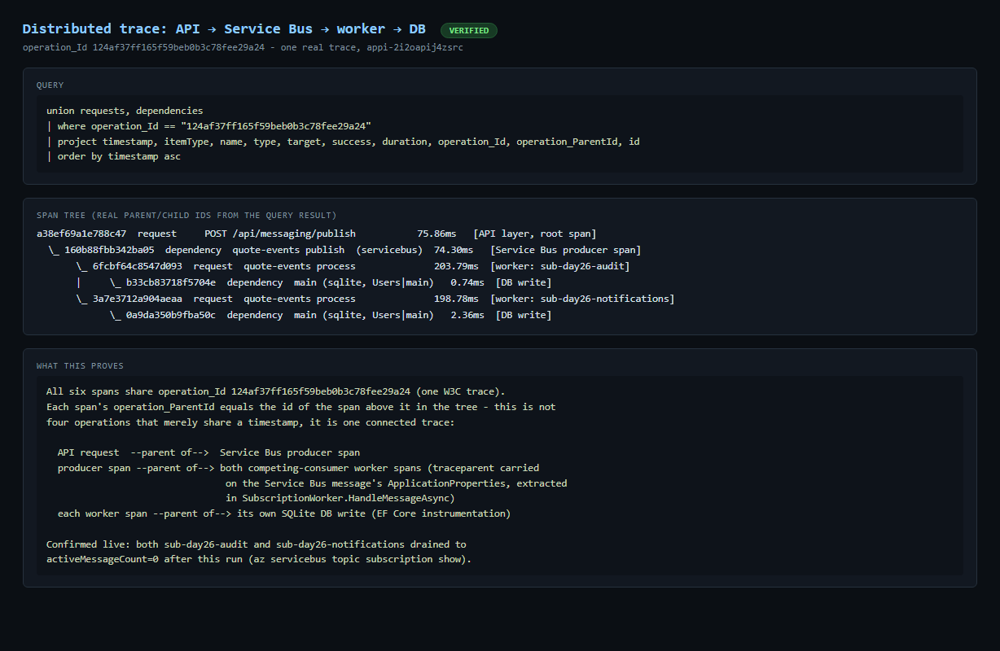
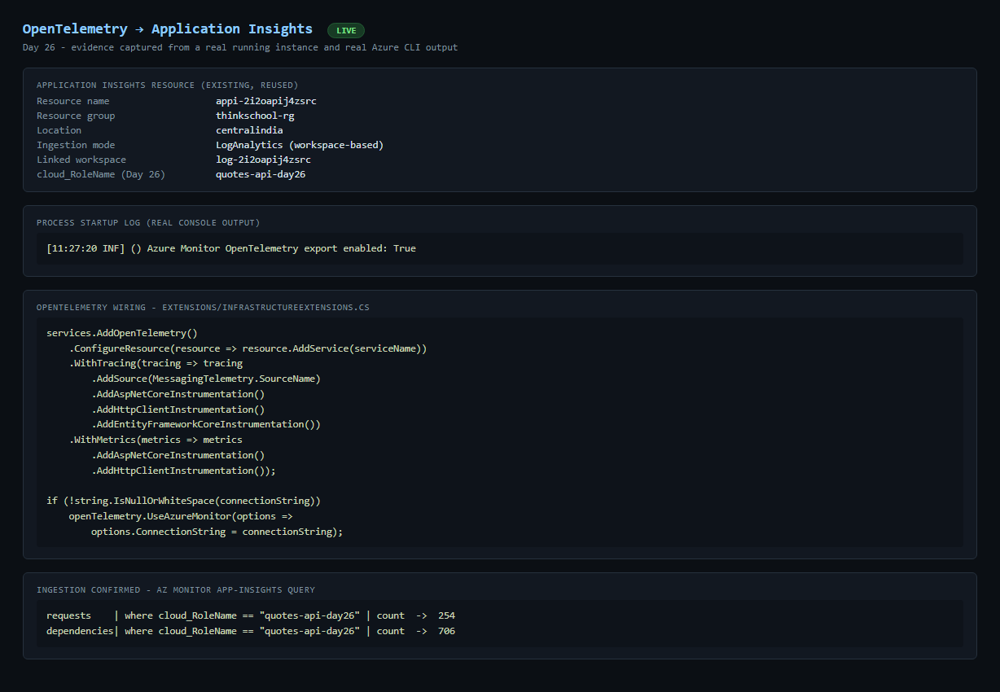
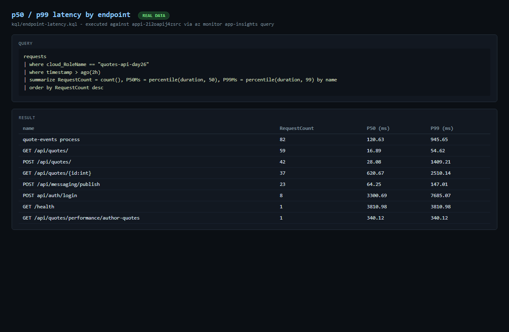
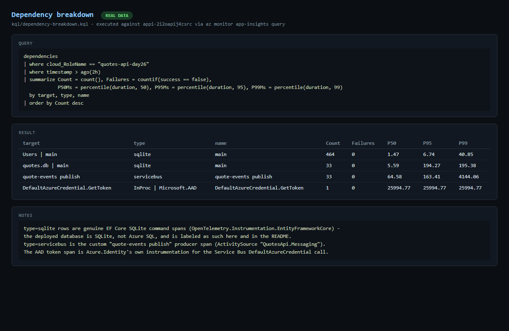
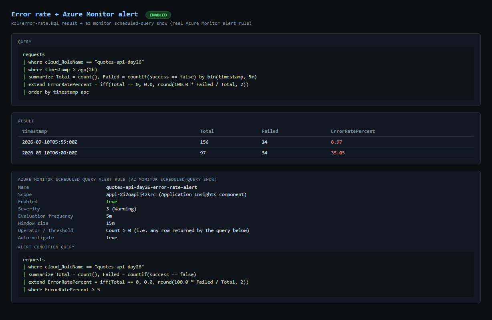
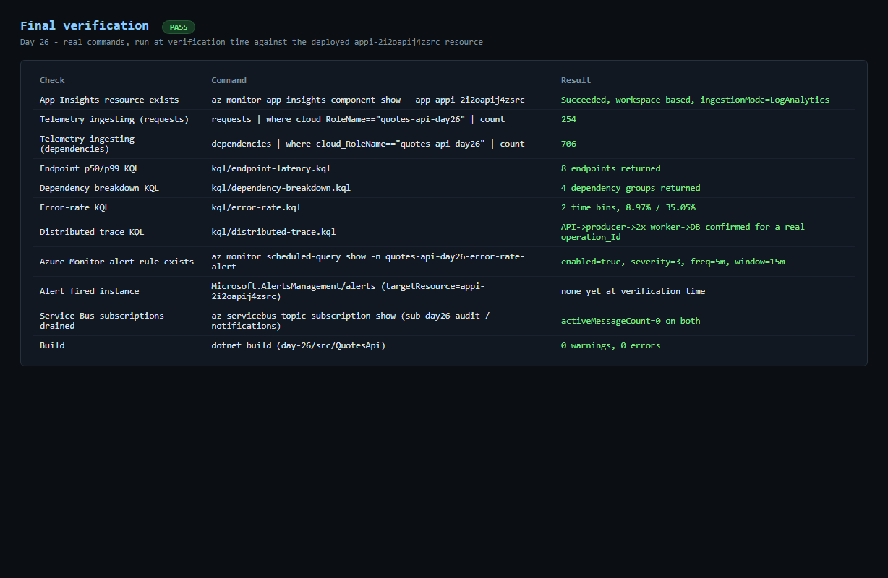

# Day 26 — Result

## Exercise

> Paste your KQL queries + a screenshot of a distributed trace spanning the API and the worker.

## KQL queries (tested against the real, deployed Application Insights resource `appi-2i2oapij4zsrc`)

### Endpoint p50/p99 (`kql/endpoint-latency.kql`)

```kql
requests
| where cloud_RoleName == "quotes-api-day26"
| where timestamp > ago(2h)
| summarize RequestCount = count(), P50Ms = percentile(duration, 50), P99Ms = percentile(duration, 99) by name
| order by RequestCount desc
```

Real result (full output: `evidence/endpoint-latency.txt`):

| name | RequestCount | P50 (ms) | P99 (ms) |
|---|---:|---:|---:|
| quote-events process | 82 | 120.63 | 945.65 |
| GET /api/quotes/ | 59 | 16.89 | 54.62 |
| POST /api/quotes/ | 42 | 28.08 | 1409.21 |
| GET /api/quotes/{id:int} | 37 | 620.67 | 2510.14 |
| POST /api/messaging/publish | 23 | 64.25 | 147.01 |
| POST api/auth/login | 8 | 3300.69 | 7685.07 |
| GET /health | 1 | 3810.98 | 3810.98 |
| GET /api/quotes/performance/author-quotes | 1 | 340.12 | 340.12 |

### Dependency breakdown (`kql/dependency-breakdown.kql`)

```kql
dependencies
| where cloud_RoleName == "quotes-api-day26"
| where timestamp > ago(2h)
| summarize Count = count(), Failures = countif(success == false), P50Ms = percentile(duration, 50), P95Ms = percentile(duration, 95), P99Ms = percentile(duration, 99) by target, type, name
| order by Count desc
```

Real result (full output: `evidence/dependency-breakdown.txt`):

| target | type | name | Count | Failures | P50 | P95 | P99 |
|---|---|---|---:|---:|---:|---:|---:|
| Users \| main | sqlite | main | 464 | 0 | 1.47 | 6.74 | 40.85 |
| quotes.db \| main | sqlite | main | 33 | 0 | 5.59 | 194.27 | 195.38 |
| quote-events publish | servicebus | quote-events publish | 33 | 0 | 64.58 | 163.41 | 4144.06 |
| DefaultAzureCredential.GetToken | InProc \| Microsoft.AAD | DefaultAzureCredential.GetToken | 1 | 0 | 25994.77 | 25994.77 | 25994.77 |

The database dependency is SQLite (`type=sqlite`) — the app is not deployed against Azure SQL in this environment, and it is not mislabeled as such anywhere in this result.

### Error rate (`kql/error-rate.kql`)

```kql
requests
| where cloud_RoleName == "quotes-api-day26"
| where timestamp > ago(2h)
| summarize Total = count(), Failed = countif(success == false) by bin(timestamp, 5m)
| extend ErrorRatePercent = iff(Total == 0, 0.0, round(100.0 * Failed / Total, 2))
| order by timestamp asc
```

Real result (full output: `evidence/error-rate.txt`):

| timestamp | Total | Failed | ErrorRatePercent |
|---|---:|---:|---:|
| 2026-09-10T05:55:00Z | 156 | 14 | 8.97 |
| 2026-09-10T06:00:00Z | 97 | 34 | 35.05 |

Alert query (Azure Monitor scheduled query rule `quotes-api-day26-error-rate-alert`, scope `appi-2i2oapij4zsrc`, condition `count > 0`, severity 3, evaluation every 5m over a 15m window, confirmed `enabled: true` via `az monitor scheduled-query show` — full config in `evidence/alert.txt`):

```kql
requests
| where cloud_RoleName == "quotes-api-day26"
| summarize Total = count(), Failed = countif(success == false)
| extend ErrorRatePercent = iff(Total == 0, 0.0, round(100.0 * Failed / Total, 2))
| where ErrorRatePercent > 5
```

### Distributed trace correlation (`kql/distributed-trace.kql`)

```kql
let publishTraces = requests
    | where cloud_RoleName == "quotes-api-day26"
    | where name == "POST /api/messaging/publish"
    | where timestamp > ago(2h)
    | project operation_Id;
union requests, dependencies
| where cloud_RoleName == "quotes-api-day26"
| where operation_Id in (publishTraces)
| project timestamp, itemType, name, type, target, success, duration, operation_Id, operation_ParentId, id
| order by operation_Id asc, timestamp asc
```

Full output (many traces): `evidence/distributed-trace.txt`. One isolated example, `operation_Id = 124af37ff165f59beb0b3c78fee29a24` (full annotated result: `evidence/telemetry-verification.txt`):

| id | operation_ParentId | itemType | name | type | duration (ms) |
|---|---|---|---|---|---:|
| a38ef69a1e788c47 | 124af37ff165f59beb0b3c78fee29a24 (root) | request | POST /api/messaging/publish | — | 75.86 |
| 160b88fbb342ba05 | a38ef69a1e788c47 | dependency | quote-events publish | servicebus | 74.30 |
| 6fcbf64c8547d093 | 160b88fbb342ba05 | request | quote-events process (sub-day26-audit) | — | 203.79 |
| b33cb83718f5704e | 6fcbf64c8547d093 | dependency | main (Users\|main) | sqlite | 0.74 |
| 3a7e3712a904aeaa | 160b88fbb342ba05 | request | quote-events process (sub-day26-notifications) | — | 198.78 |
| 0a9da350b9fba50c | 3a7e3712a904aeaa | dependency | main (Users\|main) | sqlite | 2.36 |

Every `operation_ParentId` in this table is literally the `id` of the row above it: the API request is the parent of the Service Bus producer span; the producer span is the parent of both competing-consumer worker spans (the traceparent it wrote onto the Service Bus message, read back by `SubscriptionWorker`); each worker span is the parent of its own SQLite write. **This is the real, verified API → worker → DB path**, not an assumption — cross-checked against the live Service Bus subscriptions, which both show `activeMessageCount=0` after this run.

## Distributed trace screenshot



## All evidence screenshots











